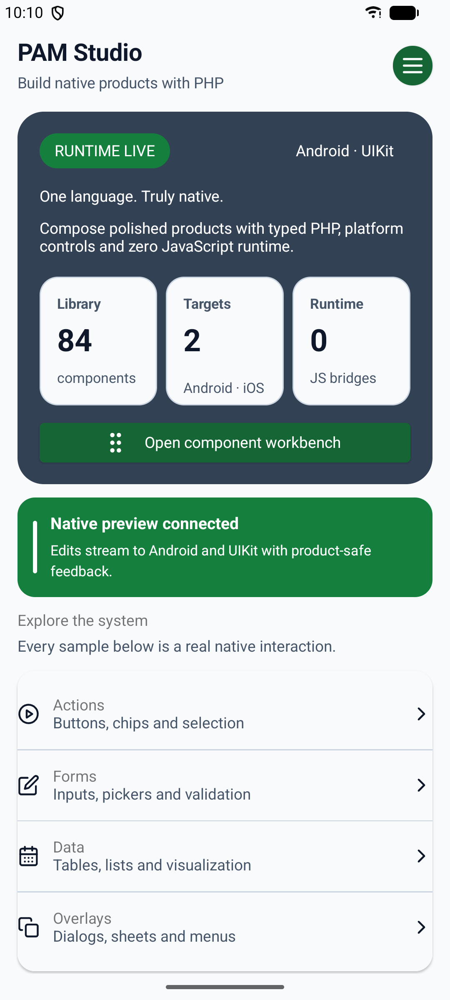
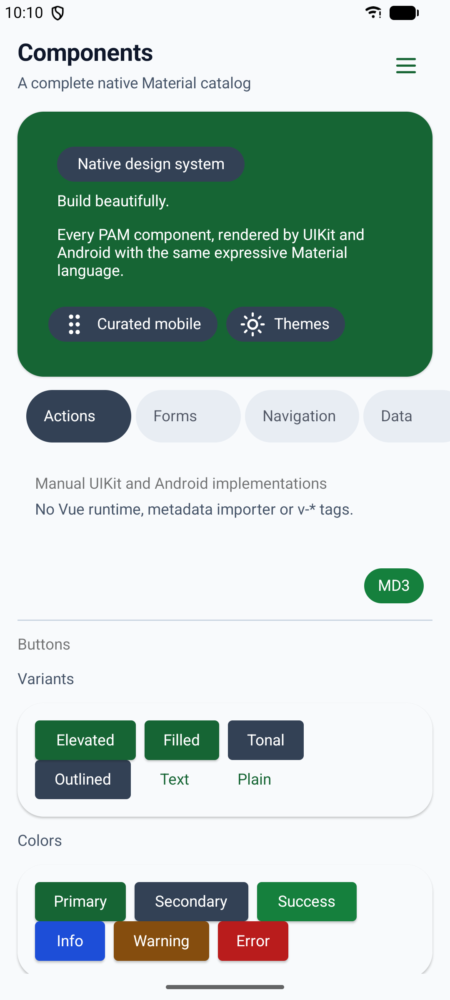
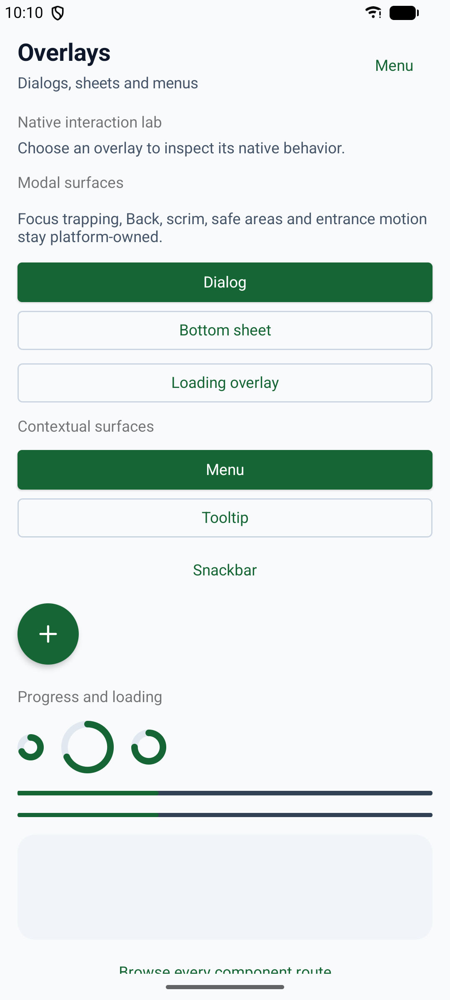

<!-- pam:product-page:start -->
<div align="center">

# PAM Native UI

**A complete retained-native component system designed for sustained frame rates.**

Compose accessible Android Views and UIKit controls with tokens, themes, responsive layouts, gestures, and UI-thread animation.

[](https://packagist.org/packages/pushinbr/pam-native-ui)
[](https://github.com/push-in/pam-native-ui/actions)


**[Documentation](https://push-in.github.io/pam-docs/native/overview/) · [Quick start](#quick-start) · [What you can build](#what-you-can-build) · [PAM ecosystem](https://push-in.github.io/pam-docs/ecosystem/) · [Issues](https://github.com/push-in/pam-native-ui/issues)**

</div>

---

## Why PAM Native UI

Compose accessible Android Views and UIKit controls with tokens, themes, responsive layouts, gestures, and UI-thread animation. The public API is strictly typed for PHP 8.5; expensive or frame-sensitive work stays in Rust or the platform SDK instead of crossing the application boundary every frame.

| | |
| --- | --- |
| **Best for** | A focused capability you can add to any PAM Native application |
| **Native path** | Android Views · UIKit · Rust layout/reconciliation |
| **Application model** | Composer package + generated native integration |
| **Design rule** | Independent module; no feed, vertical, or application template bundled |

## What you can build

- Production mobile design systems
- Responsive phone, tablet, foldable, and TV interfaces
- Accessible components with native focus and input behavior

## Quick start

All builds follow the mandatory [build hygiene contract](docs/build-hygiene.md):
final deliverables remain in `dist`, while regenerable native build outputs are
removed on exit.

Already have a PAM Native project? Add only this capability:

```bash
pam composer require pushinbr/pam-native-ui
pam doctor --fix
```

New to PAM? Follow the **[five-minute PAM Native setup](https://push-in.github.io/pam-docs/native/overview/)** once, then return here. Your application stays a normal Composer project with a committed lockfile.
<!-- pam:product-page:end -->

PAM Native UI is a retained native Material Design 3 component library for
PAM Native. It exposes 84 mobile `p-*` component parts across 62 manually authored
modules and renders through Android views and UIKit without a WebView,
JavaScript runtime, CSS engine, or Vuetify metadata importer.

## Part of the PAM ecosystem

- [PAM Native core](https://github.com/push-in/pam-native) — required native
  runtime, renderer, navigation and platform modules.
- [PAM Native Nitro](https://github.com/push-in/pam-native-nitro) —
  high-performance offline-first data for native applications.
- [PAM Native documentation](https://push-in.github.io/pam-docs/native/overview/)
  — start here if you are new to native PHP applications.
- [PAM Native UI documentation](docs/authoring.md)
  — components, themes, accessibility and performance.

This library does not wrap a web design system and call it native. Its
components, themes, motion, interaction, accessibility semantics, responsive
behavior, and platform contracts are designed for the PAM renderer itself.
The public API stays expressive and familiar; the work underneath stays close
to the operating system.

## Android showcase

The bundled catalog exercises all 84 public component parts through the real
Android renderer. Its 90 full-device captures pass route, viewport, blank-screen
and text-overlap validation before they are accepted as documentation evidence.

<p align="center">
  
  
  
</p>

See the **[Android visual showcase](docs/android-showcase.md)** for every
component screenshot, capture metadata and real interaction GIFs.

## What we are building

| Promise | Implementation |
| --- | --- |
| One component language | Typed PHP and declarative `p-*` tags share the same retained tree |
| Real native output | Android Views and UIKit, not HTML or a canvas |
| Material Design 3 | Semantic color, typography, shape, elevation and motion tokens |
| Native performance | Gesture animation and transient interaction stay on the UI thread |
| Accessibility by contract | Semantics are part of component parity and release verification |
| Honest parity | A generated manifest and executable tests gate the published surface |
| Extensible foundations | Themes, directives and native capabilities compose without forking the renderer |

## Principles

- Public templates use only the `p-*` namespace.
- Components are implemented manually for Android and iOS.
- Theme, layout, motion and interaction resolve to compact numeric native
  properties.
- Coded variants use sequential integer enums rather than string protocol
  discriminators.
- Gesture animation and transient state remain on the native UI thread.
- PHP receives requested semantic results, not animation frames.

Product-safe factories for Bottom Sheet, WebView, native media, context menus
and keyframe entrance motion are available through `NativeCapabilities`; see
[`docs/native-capabilities.md`](docs/native-capabilities.md).

## Installation

```bash
pam add mobile-ui
pam doctor
```

`pam add mobile-ui` performs dependency compatibility preflight, updates the
normal Composer manifest and lockfile, discovers `pam-native.plugin.json`, and
refreshes the Android and iOS native view registries. Direct Composer commands
are an advanced interoperability path; PAM is the supported application workflow.

## Quick start

```xml
<AppScreen>
        <p-card class="pa-6">
            <Text size="xl">Production dashboard</Text>
            <Text>Retained native Material UI</Text>
            <Text>One component contract, two native renderers.</Text>
            <p-card-actions>
                <p-btn on:press="continue">Continue</p-btn>
            </p-card-actions>
        </p-card>
</AppScreen>
```

Templates are compiled once. Android and iOS receive resolved integers,
floats, booleans and bounded payloads rather than markup or style strings.

Product feedback uses the typed `StatusBanner` instead of one-off alert
layouts. Its integer-backed tones cover information, success, warning, error
and progress, with screen-reader announcements and optional 48 dp actions.
Dashboard values use `MetricCard`, whose adaptive layout and semantic trend
labels remain understandable without color.

## Native directives

```xml
<p-card
    p-ripple
    p-click-outside="close"
    p-intersect="visibilityChanged"
    p-resize="resized"
    p-touch-start="touchStarted"
    p-touch-move="touchMoved"
    p-touch-end="touchEnded"
>
    <Text>Interactive native surface</Text>
</p-card>
```

- `p-ripple` uses `RippleDrawable` on Android and a UIKit state layer.
- `p-click-outside` observes the native root without consuming child input.
- `p-intersect`, `p-mutate` and `p-resize` emit only changed geometry.
- `p-scroll` uses native scroll delegates and display-frame coalescing.
- `p-touch-*` reports logical local/page coordinates.

All observers and recognizers detach on update, unmount, hot reload and runtime
shutdown. Ripple and motion do not cross the PHP boundary.

## Themes

Language 2 templates use PHP-free Vue-style bindings. Interpolate text with
`{{ $value }}`, bind properties with `:prop="$value"`, dispatch actions with
`@press="action"`, and bind form state in both directions with
`p-model="$field"`:

```xml
<p-text-field p-model="$query" label="Search" />
<p-img :source="$channel->logo" :accessibilityLabel="$channel->name" />
<p-btn @press="play">Play {{ $channel->name }}</p-btn>
```

```php
use Pam\MobileUi\Enum\ColorToken;
use Pam\MobileUi\PamUI;
use Pam\MobileUi\Theme\Color;
use Pam\MobileUi\Theme\Themes;

PamUI::theme(
    Themes::pamLight()->withColors([
        ColorToken::Primary->value => Color::rgb(0, 95, 184),
    ]),
    Themes::pamDark()->withColors([
        ColorToken::Primary->value => Color::rgb(167, 201, 255),
    ]),
);
```

System, light, dark and custom themes resolve per provider subtree. Components
consume semantic MD3 color, typography, shape, elevation and motion tokens.
`pamLight()` and `pamDark()` ship the contrast-gated PAM identity; `light()` and
`dark()` remain neutral foundations for fully custom brands.

## Verification

```bash
composer generate:material
composer test
composer test:recipes
composer analyse
composer release:check
```

`resources/material-parity.json` is the release gate for the new generation.
It is generated from the manual specification and requires:

- 62 sequential modules;
- 84 mobile `p-*` components with sequential component IDs;
- Android and iOS targets;
- `metadataImport=false`;
- exact equality with `MaterialComponentMap`.

Android contracts run as unit tests, emulator instrumentation and physical ADB
tests. UIKit contracts build and test through Xcode on a macOS runner before a
release can be published.

## Documentation

- [Authoring](docs/authoring.md)
- [Component catalog](docs/catalog.md)
- [Parity contract](docs/parity.md)
- [Product foundations](docs/product-foundations.md)
- [Architecture](docs/architecture.md)
- [Performance evidence](docs/performance.md)

## License

Apache-2.0. See [LICENSE](LICENSE) and [LICENSING.md](LICENSING.md).
