# Android visual showcase

PAM Native UI ships a real Android catalog application for the complete
Material surface. The evidence in this page was captured from the production
renderer on an Android API 36 emulator at 420 dpi; it is not a web mockup.

**84/84 components · 90 verified screens · 7 interaction recordings**

The automated visual audit rejects empty renders, unexpected routes, invalid
viewports and overlapping text. Its machine-readable result is available in
[`visual-audit.json`](assets/android/components/visual-audit.json), alongside
the [device manifest](assets/android/components/manifest.json).

## Catalog application

<p align="center">
  
  
  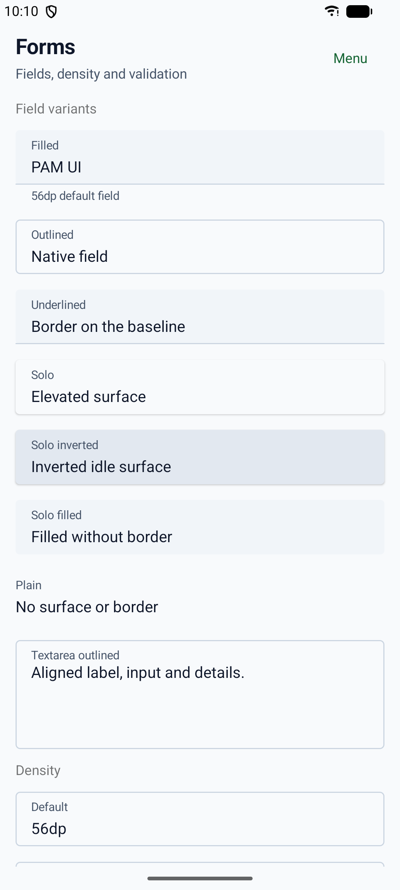
</p>

The home screen presents the product promise, verified component count and
native targets. The workbench groups actions, forms, navigation, data and
overlays while preserving direct routes for deterministic testing and docs.

## Native interaction evidence

These recordings are produced with Android `screenrecord` while the app is
running. Touch indicators are enabled so state changes can be inspected.

| Navigation | Expansion panels |
| --- | --- |
| 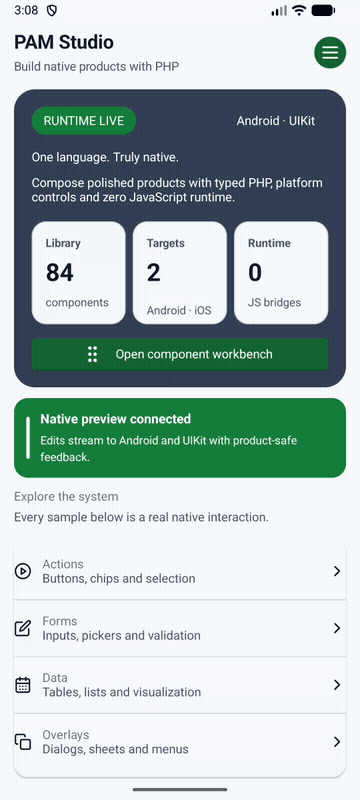 | 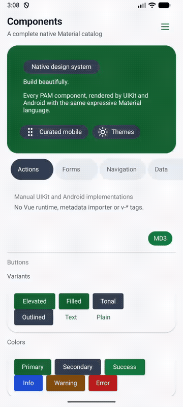 |

| Dialog | Menu |
| --- | --- |
| 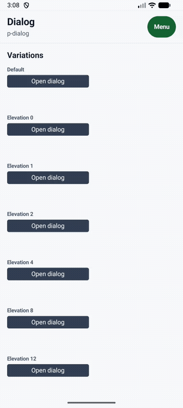 | 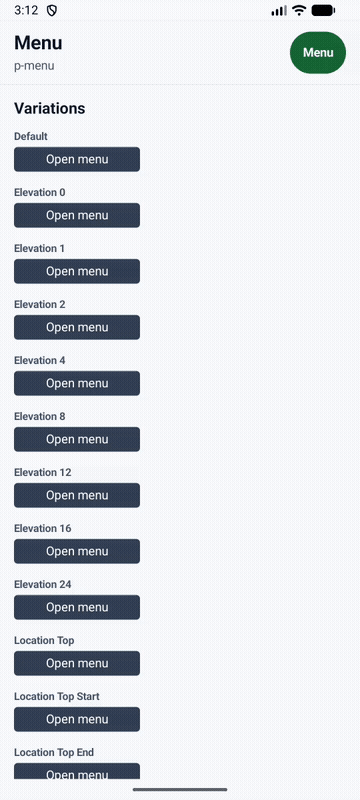 |

| Tabs | Slider |
| --- | --- |
| 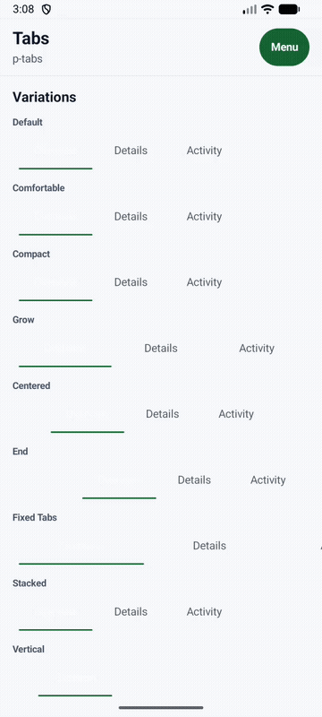 | 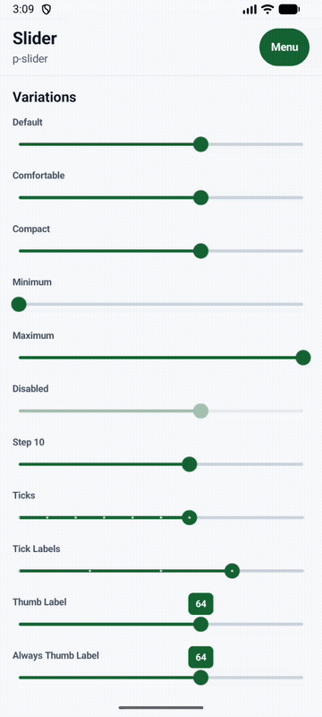 |

| System time picker |
| --- |
| 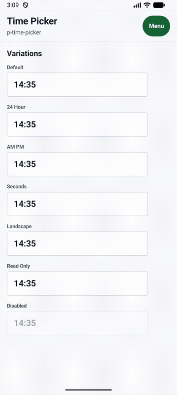 |

## Complete component evidence

Every public tag has an individual full-device screenshot. Open the
[component catalog](catalog.md) to access all 84 files next to their matching
component names. Parent and anatomy tags intentionally receive separate files
even when they share the same composed preview.

Representative surfaces:

<p align="center">
  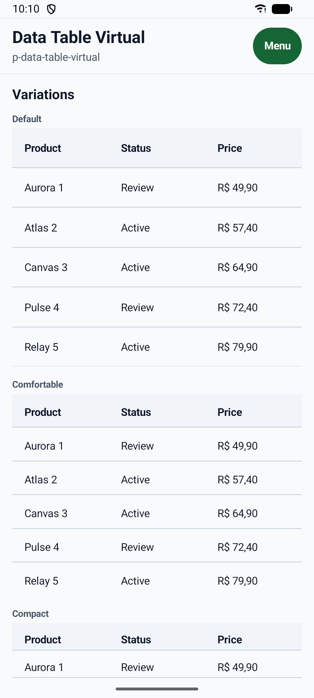
  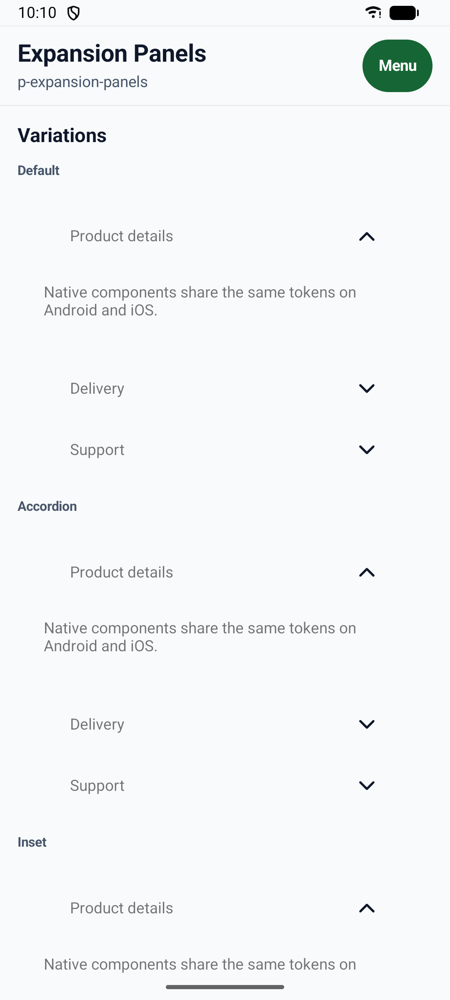
  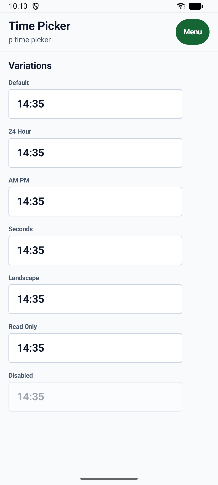
  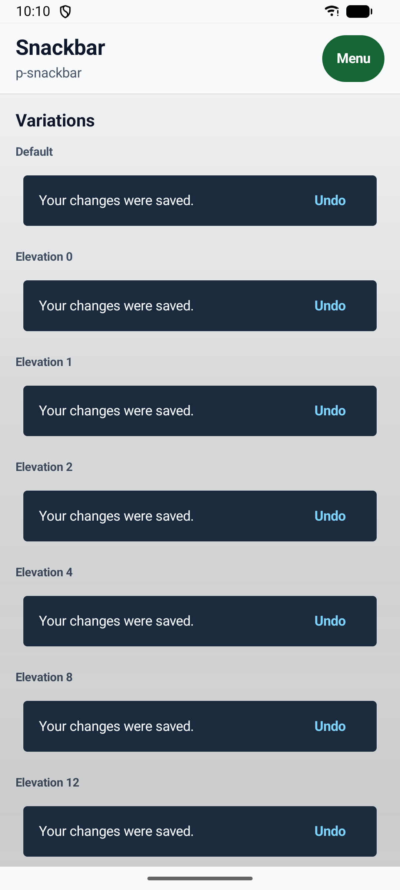
</p>

## Reproduce the evidence

Install the kitchen-sink application on exactly one emulator, or select a
device explicitly, then run:

```bash
ANDROID_SERIAL=emulator-5554 \
  tools/capture-showcase-android.sh docs/assets/android/components

ANDROID_SERIAL=emulator-5554 \
  tools/capture-showcase-android-gifs.sh docs/assets/android/gifs
```

The screenshot command validates all 90 screens before it writes the device
manifest. The GIF command reopens each deep link, performs the real native
interaction and encodes a documentation-sized animation with FFmpeg.
