# Android visual showcase

PAM Native UI ships a real Android catalog application for the complete
Material surface. The evidence in this page was captured from the production
renderer on an Android API 36 emulator at 420 dpi; it is not a web mockup.

> **Generation 2 validation is in progress.** Physical-device testing exposed
> defects that the prior screenshot-only gate did not detect. The new
> interaction and geometry matrix currently approves **5 of 84 components**.
> The remaining **79 components** have passed the emulator candidate gate, so
> the complete **84 of 84** inventory now has current audited evidence. They await
> two independent physical Samsung runs before approval.
> Candidate captures prove emulator behavior but grant no physical approval.

The previous automated visual audit rejected empty renders, unexpected routes,
invalid viewports and overlapping text, but did not prove modal-window
exclusivity or before/during/after interaction geometry. Its historical
machine-readable result is available in
[`visual-audit.json`](assets/android/components/visual-audit.json), alongside
the [device manifest](assets/android/components/manifest.json).

## Catalog application

<p align="center">
  
  
  
</p>

The home screen presents the product promise, verified component count and
native targets. The workbench groups actions, forms, navigation, data and
overlays while preserving direct routes for deterministic testing and docs.

## Native interaction evidence

These recordings are produced with Android `screenrecord` while the app is
running. Touch indicators are enabled so state changes can be inspected.

| Navigation | Expansion panels |
| --- | --- |
|  |  |

| Dialog | Menu |
| --- | --- |
|  |  |

| Tabs | Slider |
| --- | --- |
|  |  |

| System time picker |
| --- |
|  |

## Approved physical-device evidence

### Autocomplete

`p-autocomplete` passed two consecutive complete interaction runs on a Samsung
SM-G973F running Android 12 at 1080×2280 and 420 dpi. The verified flow opens
one Material bottom sheet, filters with the Samsung keyboard, selects from the
lower edge of the final 56 dp row, preserves state across backdrop and Back,
isolates multiple instances, rejects disabled/read-only interaction, renders a
single separated empty state, supports multiple selection and survives
portrait/landscape transitions without leaving the adaptive drawer open.

<p align="center">
  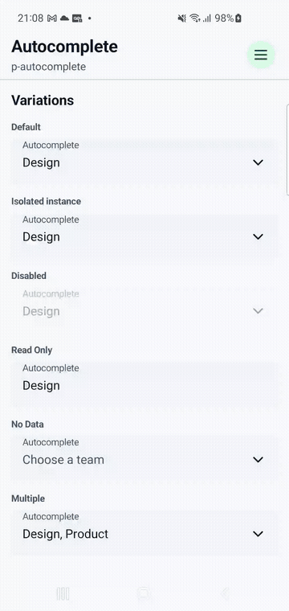
  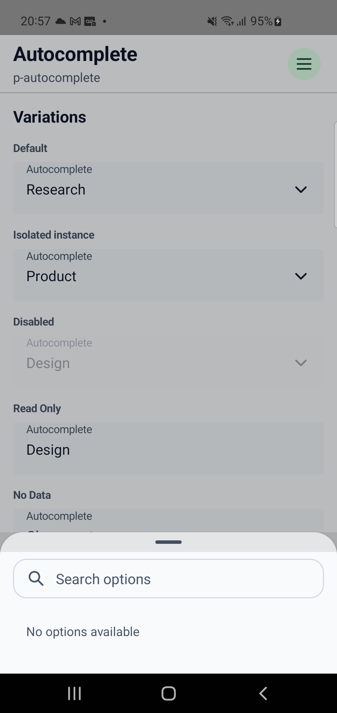
  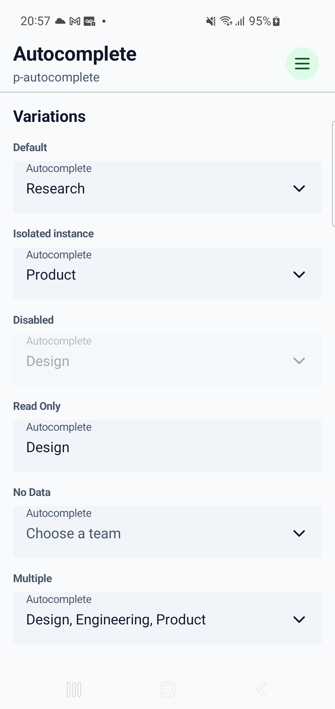
</p>

The [machine-readable report](assets/android/audit/p-autocomplete/report.json)
pins the exact APK, recording and two independent physical-run hashes. The
original MP4 is retained next to the documentation GIF.

### Combobox

`p-combobox` passed two consecutive complete interaction runs on the same
Samsung device. The verified flow enters a custom value with the Samsung
keyboard, exercises the tonal custom-value action, selects both custom and
existing values, confirms the lower edge of the final 56 dp option remains
tappable above the navigation area, preserves state across backdrop and Back,
isolates multiple instances, rejects disabled/read-only interaction, renders a
single separated empty state and survives portrait/landscape transitions.

<p align="center">
  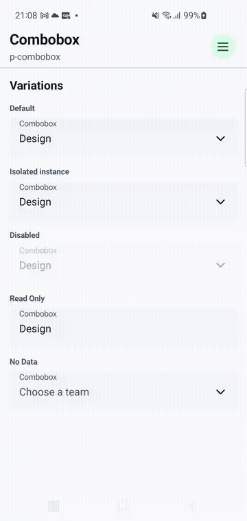
  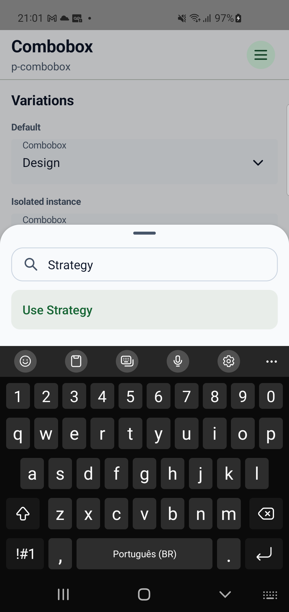
  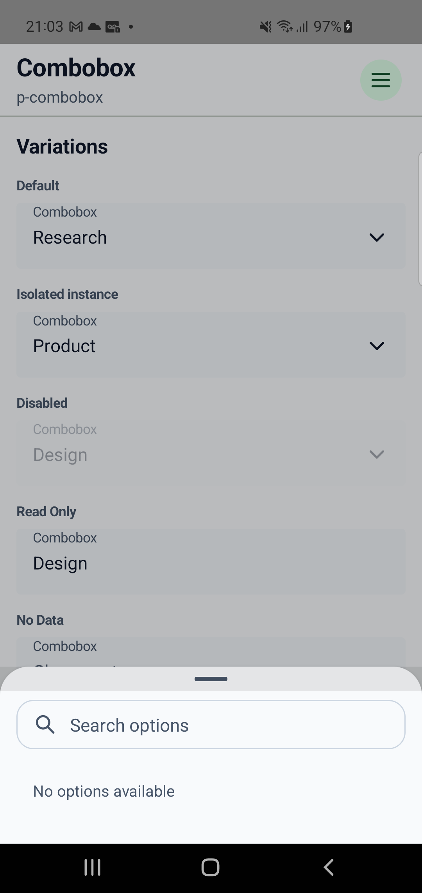
</p>

The [machine-readable report](assets/android/audit/p-combobox/report.json)
pins the exact APK, recording and two independent physical-run hashes. The
original MP4 is retained next to the documentation GIF.

### Select

`p-select` passed two consecutive physical-device runs without rendering a
search field or opening the keyboard. The runs verify ordered options,
selection, backdrop and Back dismissal, instance isolation, disabled/read-only
states, the final-row lower hit edge, one aligned empty state, Material drag
indicator, rotation, adaptive navigation and clean runtime logs.

<p align="center">
  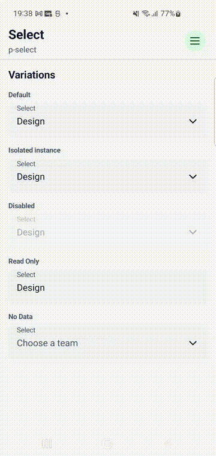
  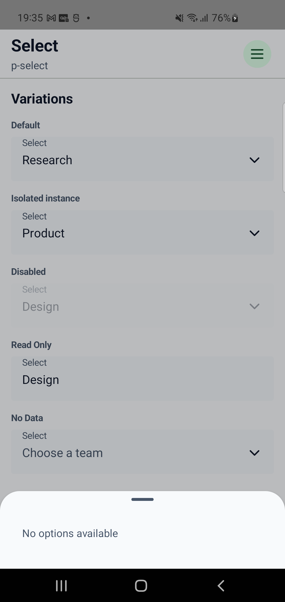
  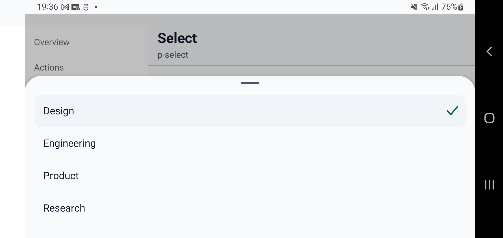
</p>

The [machine-readable report](assets/android/audit/p-select/report.json) pins
the installed APK hash and both physical-run reports.

### OTP Input

`p-otp-input` passed two consecutive complete interaction runs on a Samsung
SM-G973F running Android 12 at 1080×2280 and 420 dpi. The runs exercise the
Samsung numeric keyboard, real Backspace input, maximum length, independent
instances, disabled and read-only behavior, masking, divider and merged modes,
error and loading states, system Back, rotation with the IME open, adaptive
navigation, accessibility geometry, status-bar contrast and runtime logs.

<p align="center">
  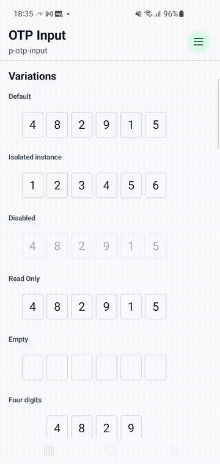
  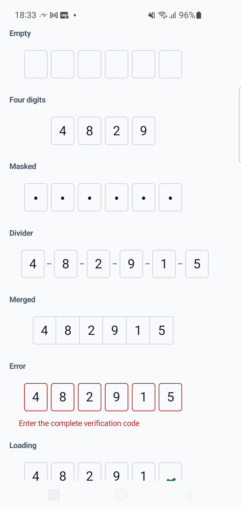
  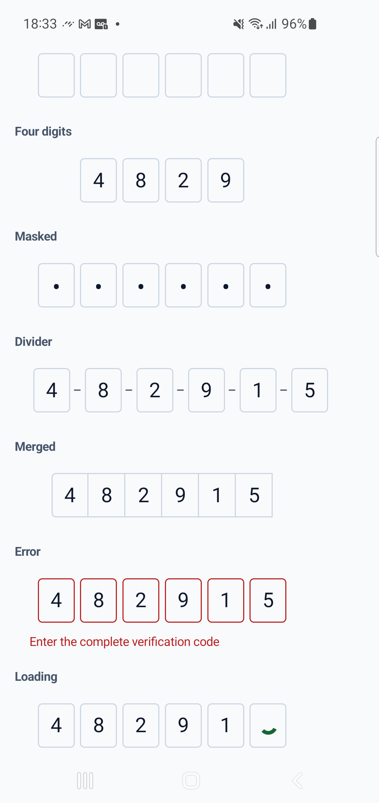
</p>

The [machine-readable report](assets/android/audit/p-otp-input/report.json)
pins the exact APK hash, two run hashes and the complete check matrix. The
original MP4 is retained next to the documentation GIF.

### Slider

`p-slider` passed two consecutive complete runs on the physical Samsung. The
runs use real drags and verify independent instances, disabled behavior, step
snapping, persistent ticks and thumb labels, reversed direction, 48 dp touch
geometry, portrait/landscape rotation, bottom and side safe areas, adaptive
navigation and clean runtime logs. The native renderer draws the Material 3
track, gap, stop indicator, ticks, state layer and expressive handle in one
pass, avoiding overlapping platform artwork.

<p align="center">
  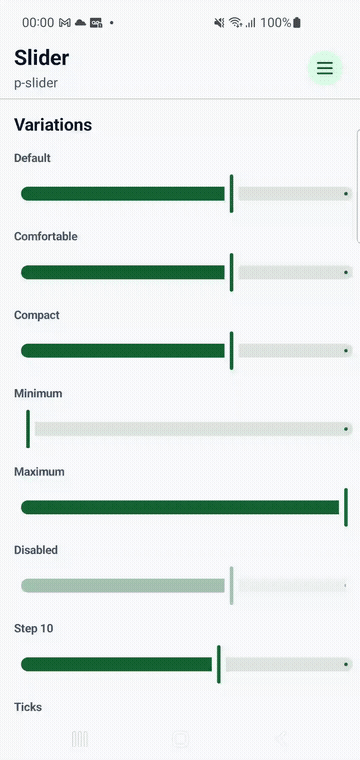
  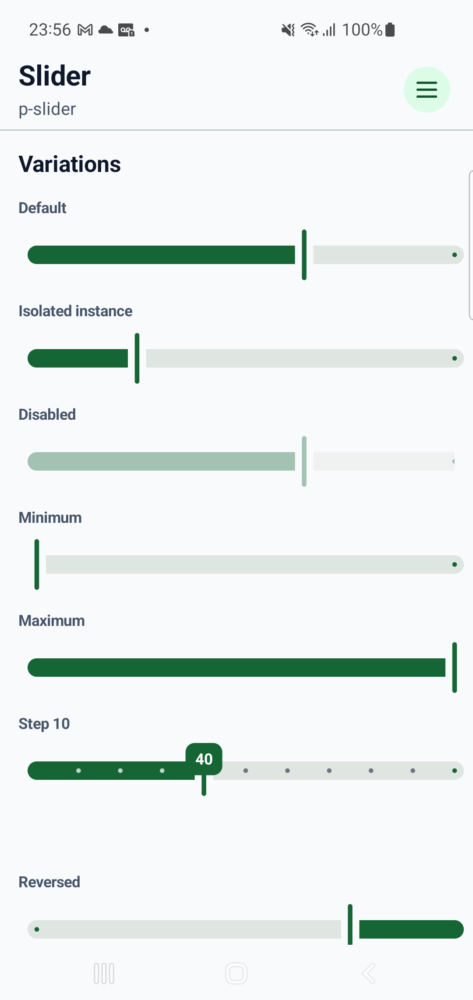
  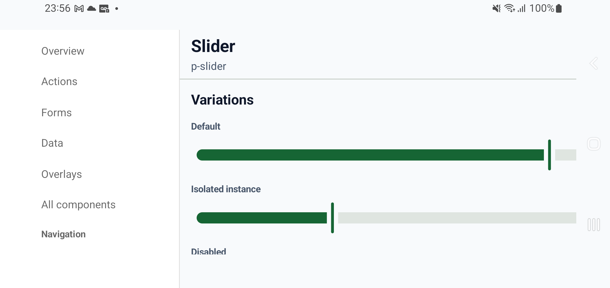
</p>

The [machine-readable report](assets/android/audit/p-slider/report.json) pins
the installed APK, recording and both independent physical-run hashes.

## Release candidates awaiting physical approval

### Alert

`p-alert` presents information, success, warning, error, closable and compact
profiles with semantic native icons and assertive live-region output. Its
Material surface now guarantees an 80dp minimum height, so wrapped supporting
copy stays inside the rounded boundary at normal and compact densities.

<p align="center">
  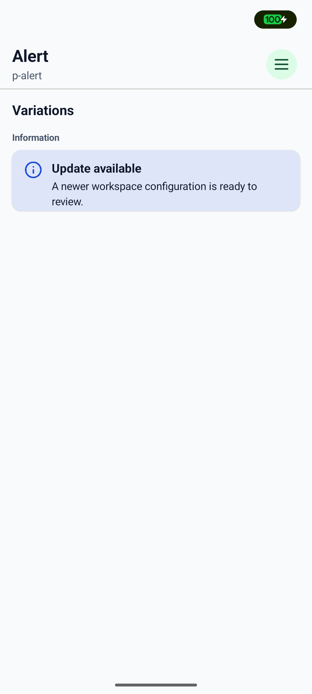
  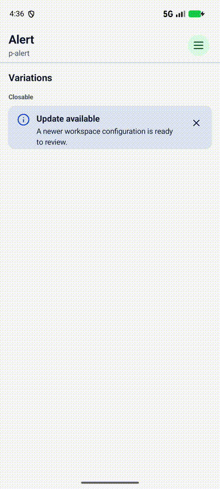
  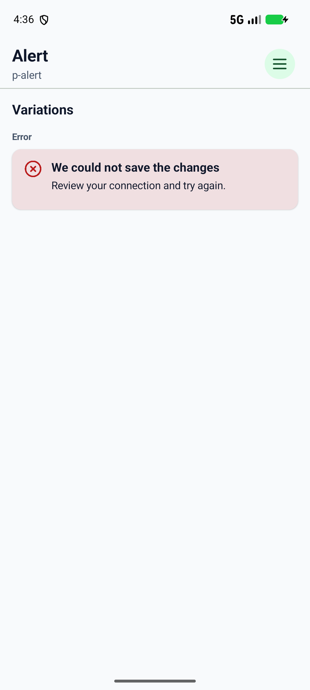
</p>

<p align="center">
  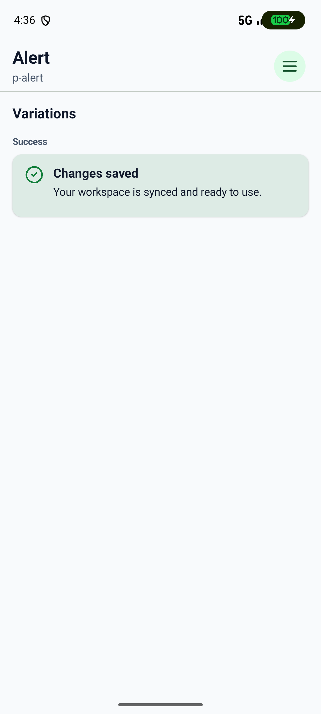
  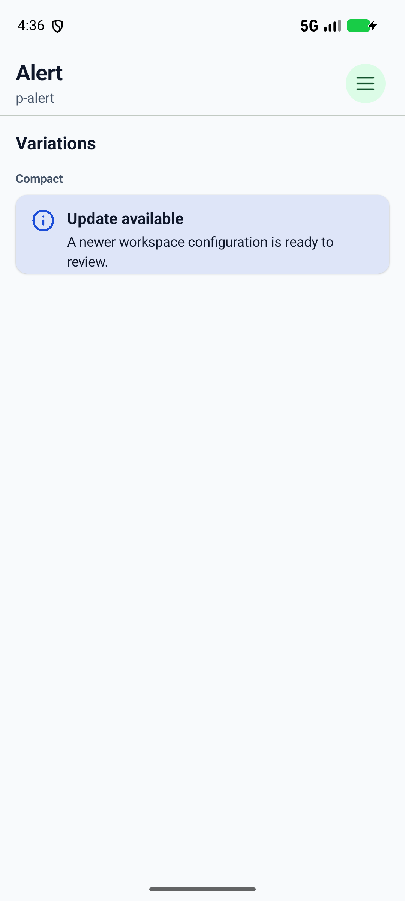
  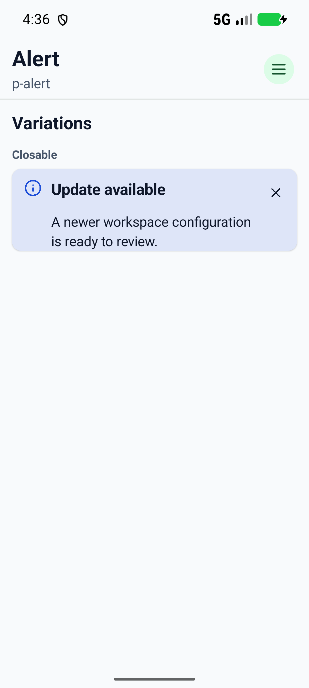
</p>

The Android gate activates the close control 3dp outside its visible 40dp
boundary to prove the effective 48dp target, validates the labelled restore
action, and checks landscape layout and runtime logs. The
[candidate report](assets/android/audit/p-alert/report-candidate.json) pins
debug APK SHA-256
`cd6f96d576fabad311c931ad5fb200fdb3a848770ba3c55a5a623a9d72fd9315`.

### Avatar and Badge

`p-avatar` demonstrates initials, team, official-icon, outlined, square and
large profiles with the 24–56dp Material size scale and descriptive native
labels. `p-badge` is shown in its real usage context, anchored to an avatar,
with count, single, `99+`, status-dot and short-label profiles instead of a
meaningless standalone number.

<p align="center">
  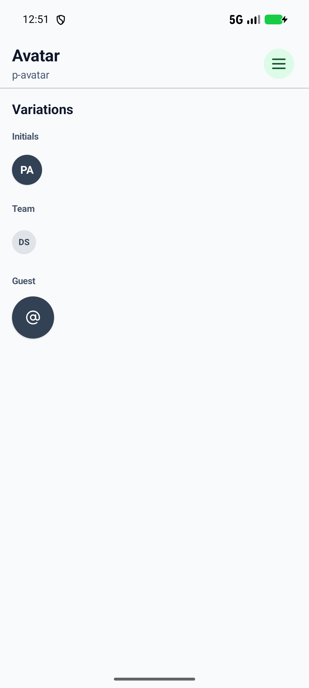
  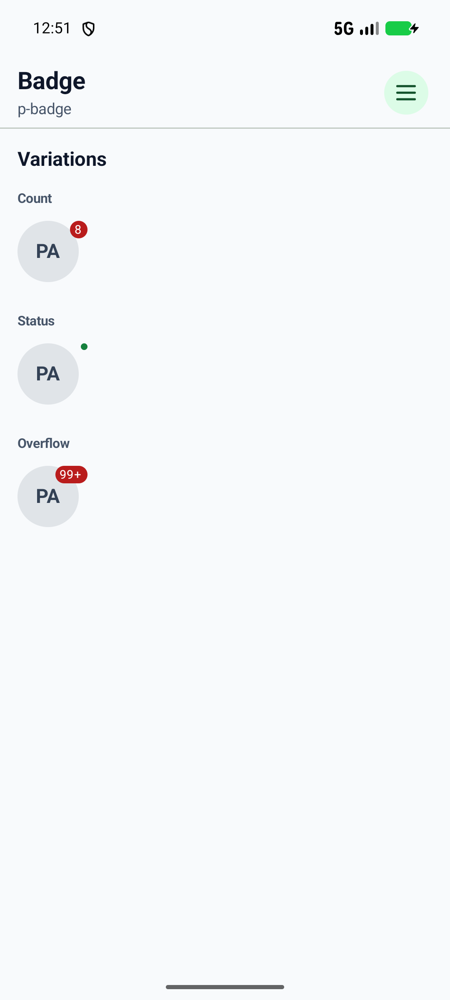
  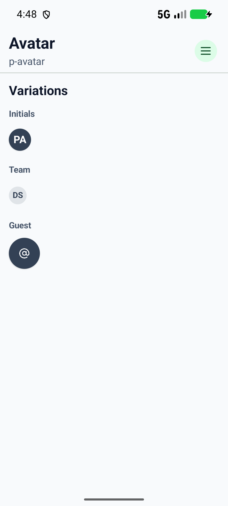
</p>

Their candidate reports pin the shared APK SHA-256
`da8eb7998c036dbf0731cfc91571b0f5152158692c4e212632ff5901b2d3310f`:
[Avatar](assets/android/audit/p-avatar/report-candidate.json) and
[Badge](assets/android/audit/p-badge/report-candidate.json).

### FAB

`p-fab` now uses official PAM icons and the correct Material geometry: 56dp
standard and extended controls, a 40dp small control, and a 96dp large
control. The extended FAB measures from icon plus label instead of being
forced into a square. Real taps independently toggle the standard and extended
actions to their completed state; disabled behavior remains inert.

<p align="center">
  
  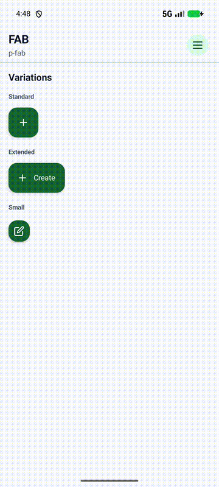
  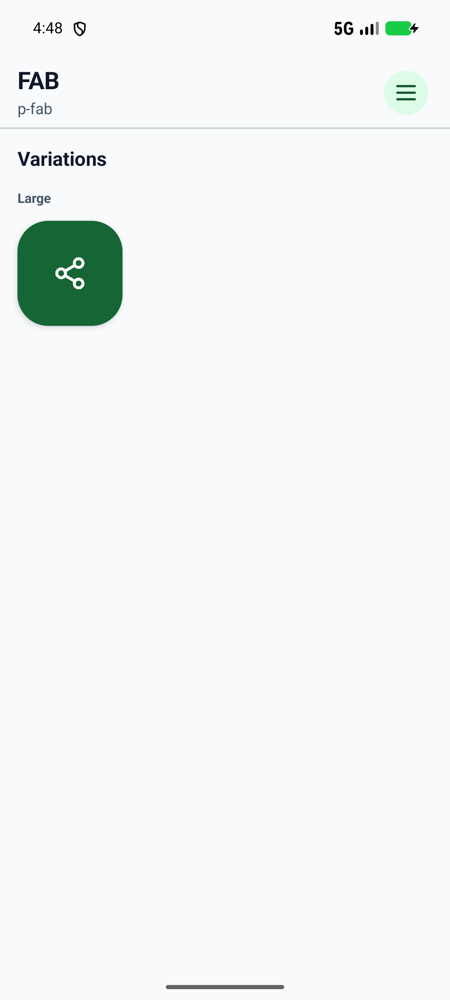
</p>

The [FAB candidate report](assets/android/audit/p-fab/report-candidate.json)
pins the same full APK and includes disabled, 130% font-scale and landscape
evidence.

### Chip

`p-chip` now demonstrates six distinct Material roles directly on the page:
assist, selected filter, removable input, outlined tag, disabled action and a
long accessibility label. Two release runs at 420 and 440 dpi verify the 32 dp
visual container with a 48 dp effective target, leading and selected icons,
filter toggling, input removal and restoration, disabled inertia, 130% font
scaling, repeated interaction and clean runtime logs.

<p align="center">
  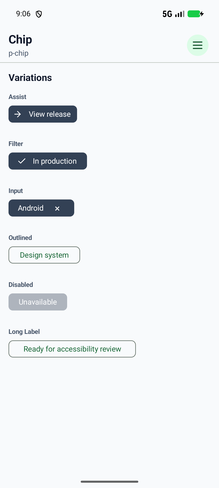
  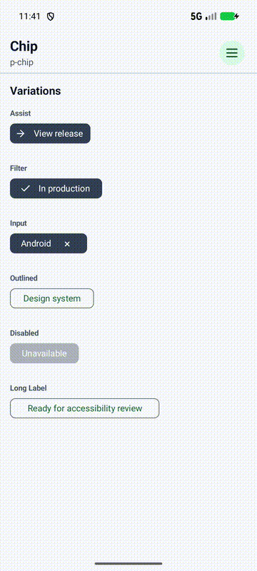
  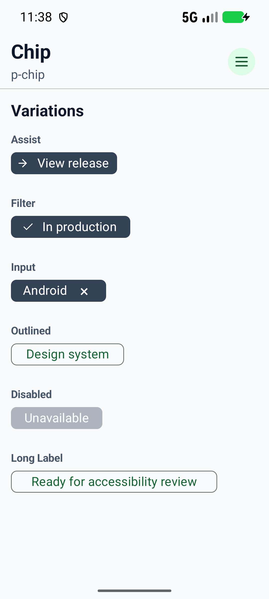
</p>

The [candidate report](assets/android/audit/p-chip/report-candidate.json) pins
the minified release APK with SHA-256
`0013c13a900eb769c2db246cb218efe5fe0d000162350132d71a015b5ddf2f68`.

### Chip Group

`p-chip-group` presents controlled single selection, multiple selection, a
true vertical column and a disabled group directly on the page canvas. The
release audit exposed and corrected three native contract defects: vertical
direction was ignored, the final vertical item had a zero-height hit region,
and disabled groups still exposed enabled children. Two passes now verify all
12 controls, 32 dp Material containers, selection feedback, 130% font scaling,
20 repeated taps and clean runtime logs.

<p align="center">
  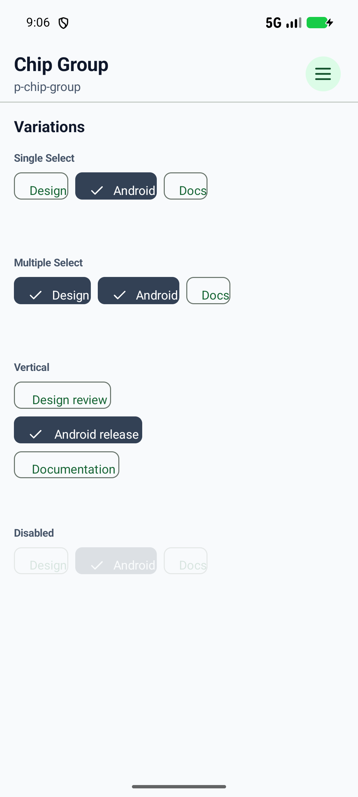
  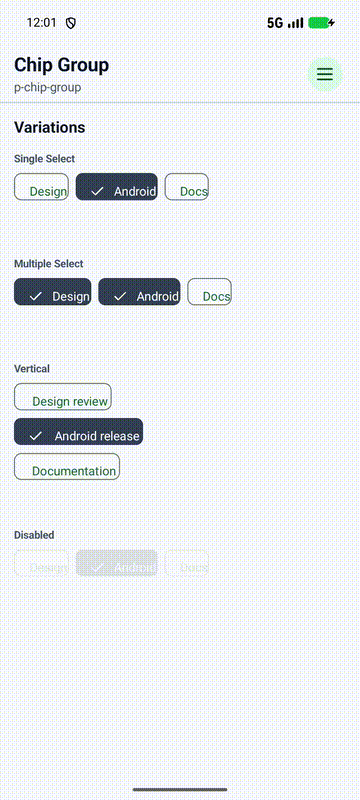
  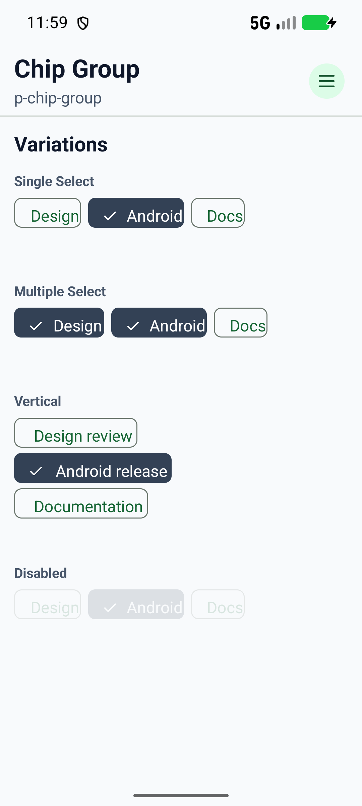
</p>

The [candidate report](assets/android/audit/p-chip-group/report-candidate.json)
pins release APK SHA-256
`7567b3a24921fbaaffa90be84295db44a105021af8d8351a0ee79c012662f8f3`.

### Color Input

`p-color-input` now demonstrates real HEX, RGB and HSL entry, a controlled
brand palette, invalid recovery guidance and a disabled state directly on the
page canvas. The audit types through the Android keyboard, converts the value
into a live colored preview, selects a palette entry through `p-chip-group`,
proves the disabled field remains inert, scales fonts to 130% and checks the
runtime log. Independent 420 and 440 dpi passes cover all six profiles.

<p align="center">
  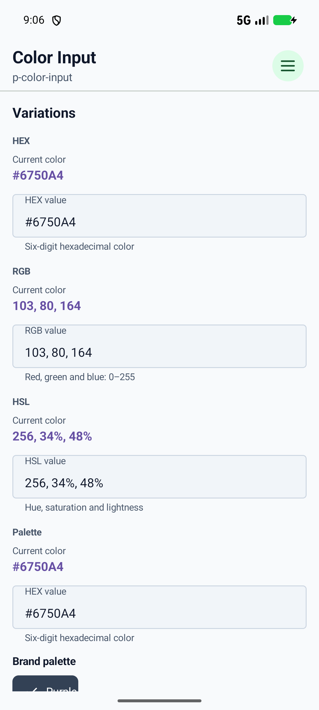
  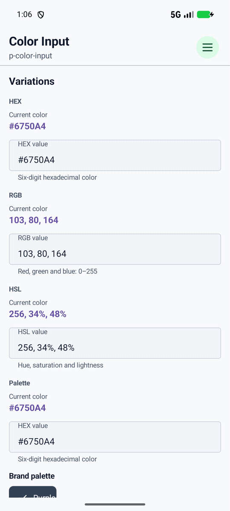
  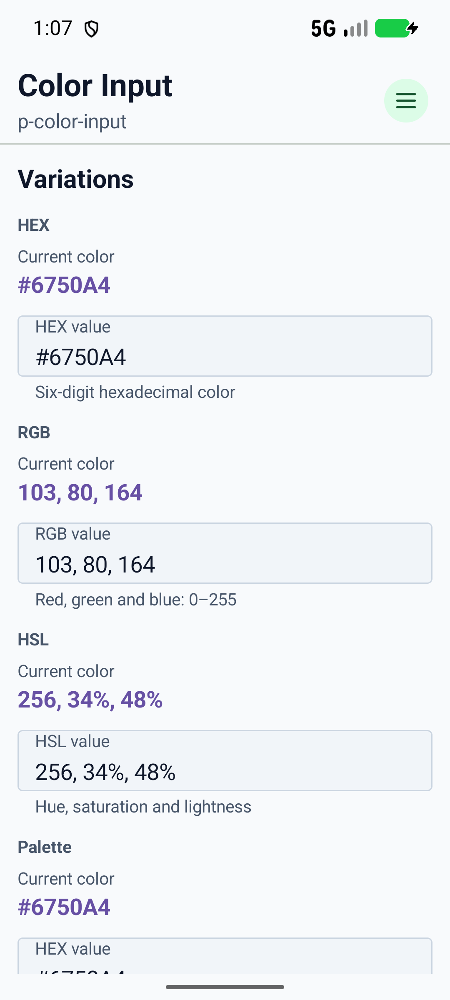
</p>

The [candidate report](assets/android/audit/p-color-input/report-candidate.json)
pins release APK SHA-256
`e81eb84cafd0f3fc10451445dfe9a2af9114863566e69bc7570fec3d38e84aab`.

### Data Table

`p-data-table` presents standard, compact, comfortable, striped, selectable,
loading, empty and mobile profiles without decorative wrapper cards. Its
controlled selection flow covers individual rows and select-all, while loading
keeps stale data readable instead of applying disabled-state opacity. The two
release passes also verify accessible empty/loading semantics, font scaling,
landscape containment and clean runtime logs.

<p align="center">
  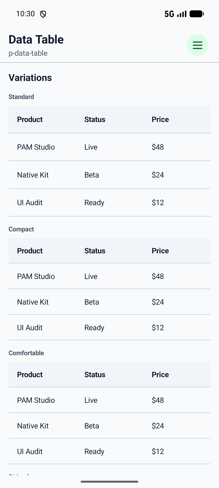
  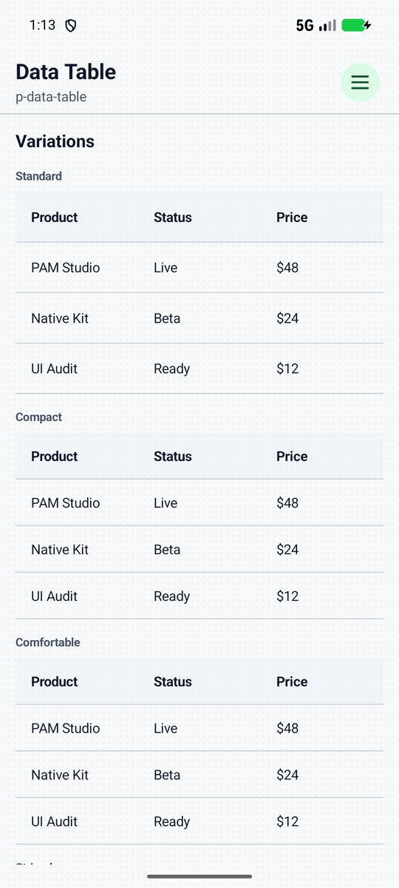
  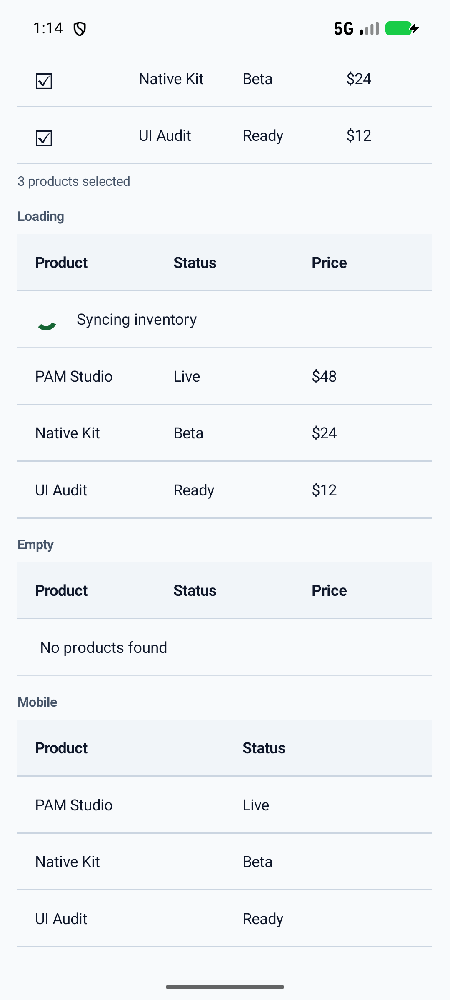
</p>

The [candidate report](assets/android/audit/p-data-table/report-candidate.json)
pins release APK SHA-256
`9c1b5ca42572f45582a4080b0f601c7af8fe74d4b58e4b974942671c177a634a`.

### Virtual Data Table

`p-data-table-virtual` shows eight bounded table profiles with 40-row data
sets while mounting only the visible window. The release audit scrolls the
inner recycler independently from the documentation page, proves rows are
recycled forward, keeps the fixed header stationary, selects a controlled row
and validates loading, empty and 130% font-scale states. Density now drives the
same row-height contract in both layout and virtualization calculations.

<p align="center">
  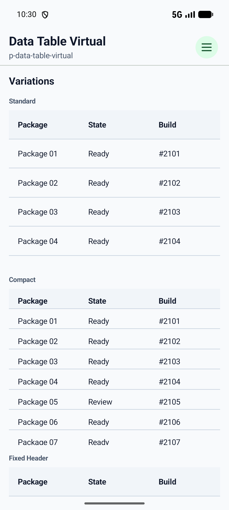
  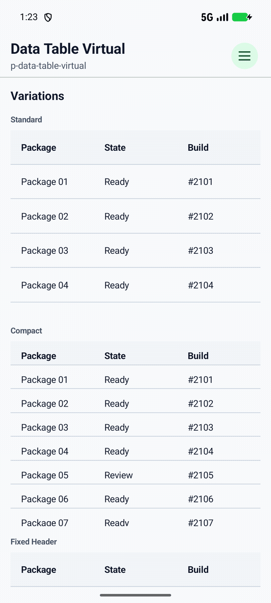
  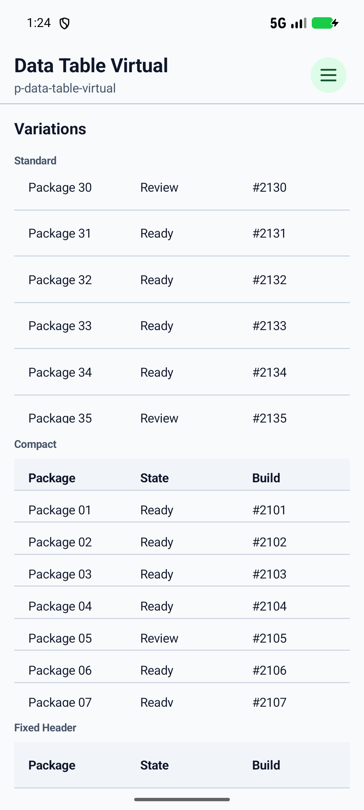
</p>

The [candidate report](assets/android/audit/p-data-table-virtual/report-candidate.json)
pins release APK SHA-256
`f8f4ebf8bd8fa4a6075758e3364ceecb47f9a6995b3d727ed000f97c7201a6c7`.

### Date Input

`p-date-input` now formats controlled `modelValue` data for display while
preserving the ISO value emitted by the public API. Its Android gate covers six
real states, opens and confirms the platform date dialog, changes one controlled
instance without mutating another, proves disabled and read-only inertia, checks
unique semantic names and repeats the layout at 130% system text scale.

<p align="center">
  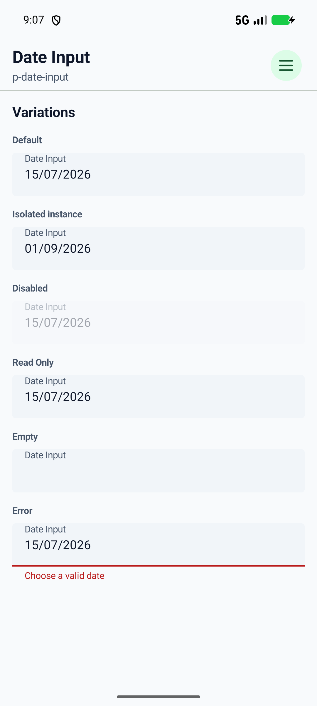
  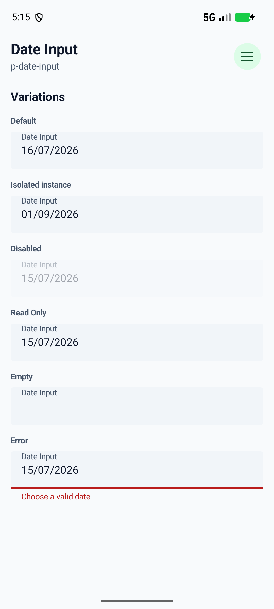
  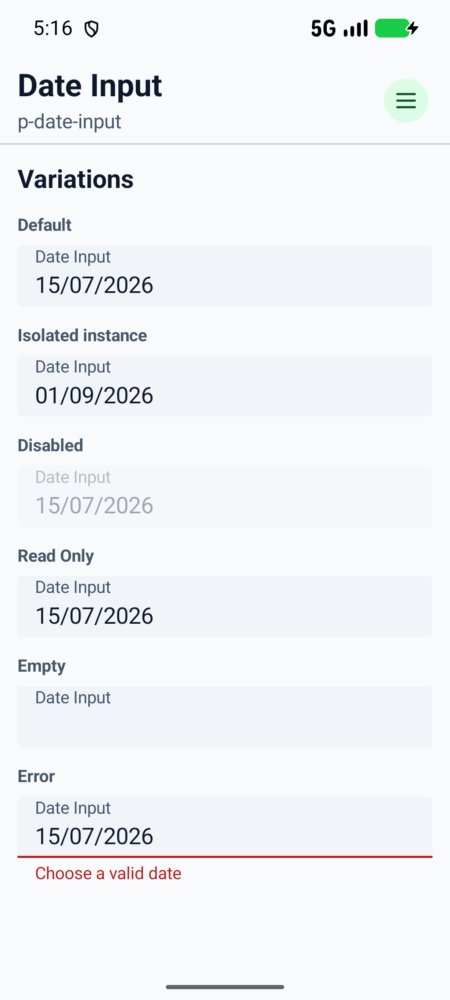
</p>

The [candidate report](assets/android/audit/p-date-input/report-candidate.json)
was produced from the consolidated multi-ABI debug APK with SHA-256
`575539473ef3a88437930f881a04abe94b591a61e9176cc953d6bde6d1eaf059`.
Physical-device evidence remains required for final approval.

### Date Picker

`p-date-picker` renders a full native calendar directly on the page canvas.
Its gate performs a real controlled day selection, navigates between months,
checks range endpoints and bounded dates, verifies read-only and disabled
inertia and repeats at 130% system text scale. Week numbers now have dedicated
TalkBack nodes in both LTR and RTL layouts without stealing day-cell touches.

<p align="center">
  
  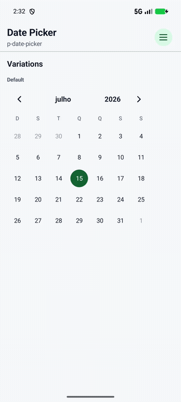
  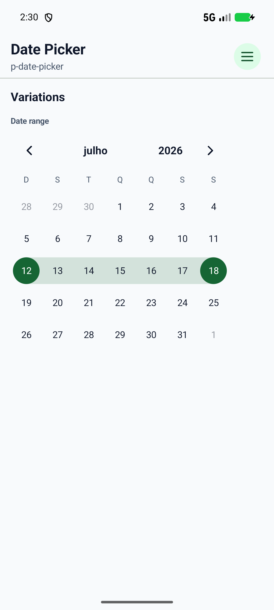
</p>

<p align="center">
  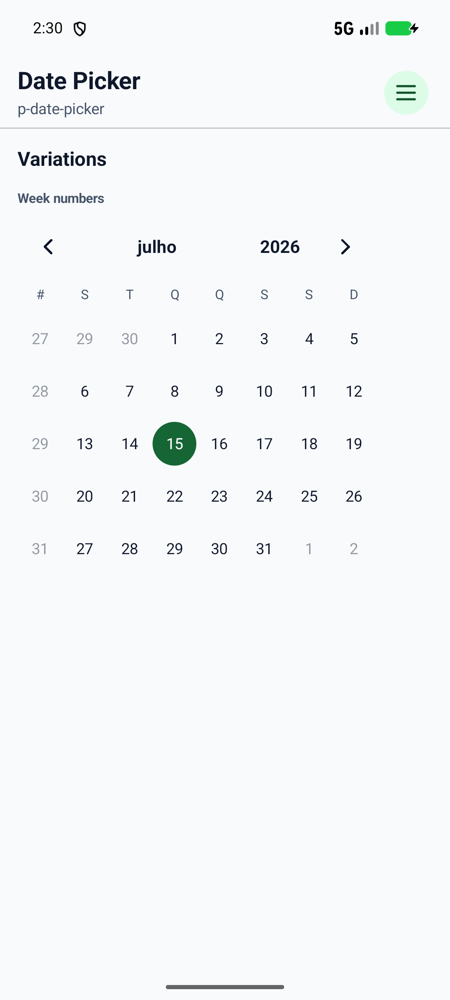
  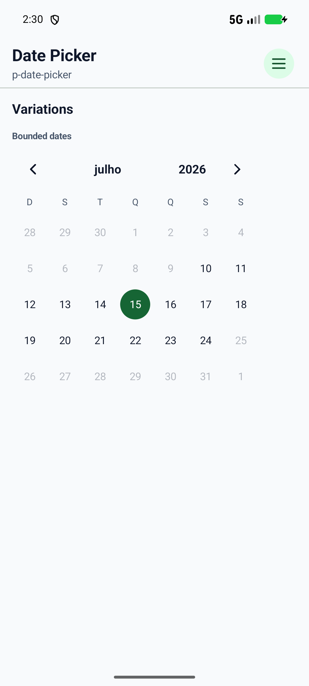
</p>

The [candidate report](assets/android/audit/p-date-picker/report-candidate.json)
records passes at 420 and 440 dpi against debug APK SHA-256
`df856dea6b66c4103824c3a02273ea55c4ad2a7e24c088230de7e7c371f287d5`.
Release and physical-device gates remain required for approval.

### Time Picker

`p-time-picker` uses the platform Android clock rather than a simulated PHP
surface. The automated gate selects a real hour and minute, changes the
controlled value from 14:35 to 15:45, verifies both 12-hour and 24-hour modes,
proves read-only and disabled inertia, repeats at 130% system text scale and
checks the runtime log. The public `format="24hr"` prop is normalized to the
native `is24Hour` contract, so the 24-hour clock exposes 13–23 without AM/PM.

<p align="center">
  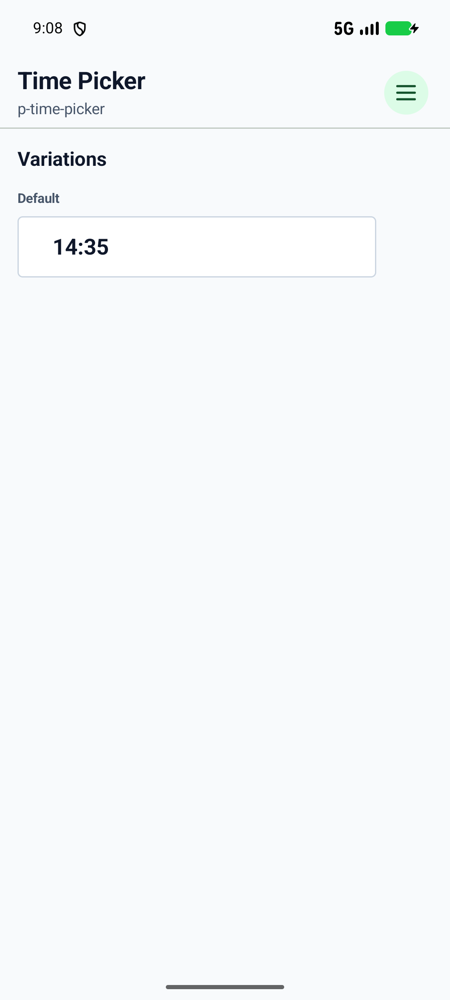
  
  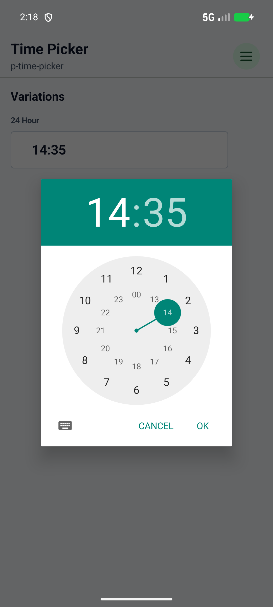
</p>

The [candidate report](assets/android/audit/p-time-picker/report-candidate.json)
records two debug-APK passes at 420 and 440 dpi. The tested APK SHA-256 is
`9b20546d1261b7ec1f29333c7a18a771e5ca55310c4731478d57a74e28ce75d0`.
This remains an emulator candidate until the consolidated minified release and
physical Samsung gates pass.

### Divider

`p-divider` is demonstrated directly between real content rather than inside a
decorative preview card. The Android gate measures the default 1 dp rule, 72 dp
inset, 4 dp emphasis rule and 1×48 dp vertical orientation, then samples the
rendered pixels to prove neutral, primary and secondary colors are distinct.
It also confirms the divider never exposes a click action and remains aligned
at 130% text scale and in landscape.

<p align="center">
  
  
</p>

The [candidate report](assets/android/audit/p-divider/report-candidate.json)
records two debug-APK passes at 420 and 440 dpi. A GIF is intentionally omitted
because Divider has no interactive or animated state; screenshots and pixel
measurements are the authoritative evidence.

### Dialog

`p-dialog` now presents six direct-canvas examples with a real Android modal
window: default, persistent, transparent-scrim, fullscreen, compact and large.
The gate activates both authored actions, Android Back and the backdrop with
real taps; it also proves that a persistent dialog ignores Back and outside
touch while remaining closable through its explicit action. Fullscreen content
respects the status-bar safe area, and compact/fluid widths retain Material
phone margins at both 420 and 440 dpi.

<p align="center">
  
  
  
</p>

<p align="center">
  
  
  
</p>

The [420 dpi report](assets/android/audit/p-dialog/report-420-candidate.json)
and [440 dpi report](assets/android/audit/p-dialog/report-candidate.json) pin
debug APK SHA-256
`679966f2db9ef90f461d2050326b76b72831cf9df4fc1fcd7f0aeda01d3bf4fe`.
This remains an emulator candidate until the physical Samsung approval gate.

### Empty State

`p-empty-state` is presented directly on the page canvas with no decorative
outer card. Five product-ready profiles cover first content, empty search,
offline recovery, permission access and compact inbox states. Each profile uses
an official PAM icon, a clear title/supporting-copy hierarchy and one focused
Material action. The default action updates the controlled state to a success
confirmation instead of acting as static sample copy.

<p align="center">
  
  
  
</p>

<p align="center">
  
  
  
</p>

The gate taps 3dp beyond the visible 40dp button to prove its expanded 48dp
touch target, verifies semantic summary output, samples pixels to reject an
accidental outer surface, and repeats at 130% font scale and in landscape. The
[420 dpi report](assets/android/audit/p-empty-state/report-420-candidate.json)
and [440 dpi report](assets/android/audit/p-empty-state/report-candidate.json)
pin debug APK SHA-256
`b9ecfff545c67d1ecad04d42d403ce5c2db7c1b6c63aed3efcb18c3abb2ae32a`.
Physical-device approval remains pending.

### Expansion Panels

The complete `p-expansion-panels` family now uses a direct, flat accordion
composition: there is no
decorative container card and no active-item jump. Headers follow the Material
spacing grid, use a minimum 48dp touch target, preserve readable contrast, and
rotate one official PAM chevron to communicate state. Each native target has a
distinct label and expand/collapse hint instead of the former duplicated group
label.

<p align="center">
  
  
  
</p>

The individual anatomy routes are functional examples rather than isolated
placeholder text. `p-expansion-panel` collapses and reopens its native content,
`p-expansion-panel-title` toggles its weight and chevron, and
`p-expansion-panel-text` demonstrates the intended title/body hierarchy and
wrapping behavior.

<p align="center">
  
  
  
</p>

<p align="center">
  
  
  
</p>

The focused Android gate opened two different sections, collapsed the active
section, inspected the accessibility hierarchy, and checked compact, disabled,
130% font-scale and landscape states without fatal runtime logs. The
[machine-readable report](assets/android/audit/p-expansion-panels/report-candidate.json)
pins debug APK SHA-256
`3af6f11223fa9d1daba32f4d971d0f798a57d00e1211ea092968a35a5b645058`.
Physical-device approval remains pending.

### App Bar

`p-app-bar` has passed two independent complete runs against the corrected
minified x86_64 release on the API 36 emulator. The gate activates navigation
and options independently, proves the Material 48 dp touch target by tapping
3 dp outside the visible option control, and validates Default, Primary,
Prominent, Compact, Flat and elevation 0–5. It also checks 64/128/48 dp
geometry, 4 dp action-row edge insets, primary contrast, light system-bar
contrast, instance isolation, rotation, adaptive navigation and clean runtime
logs. Shadow depth is measured from rendered pixels: elevation 0 remains at
250 luminance, while elevation 5 starts at 204 and softens to 227.5 away from
the surface.

<p align="center">
  
  
  
</p>

The [candidate report](assets/android/audit/p-app-bar/report-candidate.json)
comes from the minified x86_64 release with SHA-256
`62e65e776994a2ac628e46b4620b6aec3205b2a514047493211c14b2e7fb852c`.
The two independent report hashes are
`49be68daf7facd0cc149d7e8265d75c9bd71186c57af9650b7f66ca3d94cec5d`
and
`8cce8b930347188b0d034e10186ac8bb3623d1064449eb69e75d0e782f47d169`.
The matching ARM64 physical-test artifact has SHA-256
`8f1f3a350afb48d7129ca167d9c9daa587f2a405e121dfc217bc4302742ccce4`.
This remains a release candidate until two independent Samsung runs and their
recording receive manual approval.

### App Bar Navigation Icon

`p-app-bar-nav-icon` has passed two independent complete runs against the
minified x86_64 release on the API 36 emulator. The gate exercises actual
presses at both usable edges of the control, confirms callback and instance
isolation, rejects disabled interaction, and verifies Default, Back, Close,
Extra Small, Small, Large, Extra Large, Primary, Secondary and custom-color
rendering. Every variation keeps an exact 48 dp circular target while its
18–32 dp glyph remains centered. A held `ACTION_DOWN` capture proves the 40 dp
circular Material state layer instead of relying on a static screenshot. The
same runs also verify accessibility labels, system-gesture-inset handling,
rotation, adaptive navigation, system-bar contrast and clean runtime logs.

<p align="center">
  
  
  
</p>

<p align="center">
  
</p>

The [candidate report](assets/android/audit/p-app-bar-nav-icon/report-candidate.json)
comes from the minified x86_64 release with SHA-256
`bf45fa4b477e2c244aad83a80f44791fb5e08179da873d91830c700c0ed26336`.
The two independent report hashes are
`7a52aca32881e220d5b009f474353ff77b62e6aa1c2e1ae96d09fe4e30f74cef`
and
`85045117e0289f6ee619873f795e58a711e49be1f55575d75fc4fd21b550bd7c`.
The matching ARM64 physical-test artifact has SHA-256
`54da9166a1b693b23873dab4790ddff3a21044c68cb9c629f8f50327b843ce59`.
This remains a release candidate until two independent Samsung runs and their
recording receive manual approval.

### Banner

`p-banner` has passed two independent complete runs against the corrected
minified x86_64 release on the API 36 emulator. The gate measures all twelve
variations, including intrinsic one-, two- and three-line heights, the 4/8 dp
spacing grid, 16/64 dp content axes, 8 dp trailing action inset and the exact
48 dp effective target around each 40 dp text action. It executes Later,
Update, Got it, disabled, dismiss and restore behavior, proves instance
isolation, and verifies polite alert semantics, four distinct tonal semantic
surfaces with explicit textual meaning, 130% Android font scaling, rotation,
adaptive navigation, system-bar contrast and clean runtime logs.

<p align="center">
  
  
  
</p>

<p align="center">
  
  
</p>

The [candidate report](assets/android/audit/p-banner/report-candidate.json)
comes from the minified x86_64 release with SHA-256
`5001b04e7c11c699db671310128a03e7a7f7bc78cc57515d1b7d72a7f4309272`.
The two independent report hashes are
`016fa95dd97d308fcd49c6d04ffadd024bc6180dbd5854a222aee9d0b196ca5d`
and
`dfdb29331e5949964778cc36f7dad1b6adfd2502cd6a9451149b76e5bffdb4d7`.
The matching ARM64 physical-test artifact has SHA-256
`1f907c51cb168a9fdab67e136b8839d03aaedc555794397084859e75484295de`.
This remains a release candidate until two independent Samsung runs and their
recording receive manual approval.

### Banner Actions

`p-banner-actions` has passed two independent complete runs against the
minified x86_64 release on the API 36 emulator. Its dedicated route replaces
the former generic text placeholder with five real arrangements: a default
pair, a single action, a disabled-leading pair, long labels and an independent
pair. The gate verifies 48 dp rows, centered 40 dp text actions, exact 48 dp
effective targets above and below the visible control, 8 dp inter-action gaps,
end alignment, transparent text-only surfaces, callbacks, disabled behavior,
instance isolation, long-label containment, 130% Android font scaling,
rotation, adaptive navigation and clean runtime logs.

<p align="center">
  
  
  
</p>

<p align="center">
  
</p>

The [candidate report](assets/android/audit/p-banner-actions/report-candidate.json)
comes from the minified x86_64 release with SHA-256
`6626b5d7cb4409b570919c0d4fab2cca351cc13189bc3cfcfb822812cb369997`.
The two independent report hashes are
`c63122f4f4f1c4504b6149dbf6e04b5108c247e65bbe4fa40ddb56e0b112f31b`
and
`5bab5f61844df134e7d3b0e300b41d22a298494b2f63664c211169580f88d30d`.
The matching ARM64 physical-test artifact has SHA-256
`238f2fd0f2ea804fcd50a175a6b5df86d190e82c1b718a2e5bf5b6ea564c8400`.
This remains a release candidate until two independent Samsung runs and their
recording receive manual approval.

### Button

`p-btn` has passed two independent 21-check runs against the minified x86_64
release on the API 36 emulator. Its dedicated route presents nineteen real
variations without decorative preview cards: elevated, flat, tonal, outlined,
text-only, plain, leading/trailing icon, block, Material expressive sizes,
compact density, semantic colors, disabled and loading. The gate presses every
enabled variation, proves instance isolation, captures the Material pressed
state, and taps 3–6 dp outside the 32/40 dp visual bounds to verify the exact
48 dp effective target. It also measures 20 dp icons and progress, 8 dp icon
gaps, consistent 12 dp caption-to-target spacing, contrast from 5.02:1 to
10.35:1, 130% Android font scaling, adaptive landscape geometry and clean
runtime logs. A separate twelve-tap stress pass retained all callbacks with
zero legacy janky frames and a 16 ms frame p99.

<p align="center">
  
  
  
</p>

<p align="center">
  
  
  
</p>

The [candidate report](assets/android/audit/p-btn/report-candidate.json) comes
from release APK SHA-256
`30a941dfa17abe7096dfd28906342e41b7d6ff8c75aca159bdd37477523bd647`.
The two independent report hashes are
`f3dd9d0c2a974b25b41e3a4b40ed11d2267345f14d8fe928bc56e7224ef2caed`
and
`9b932de4c604e16456d40ec0e1b042b8f521e18ce7eca05f4994cee260247f72`.
The matching ARM64 physical-test artifact has SHA-256
`128476993bb0d5373f108fed713672525c9bf1de7b2432b740d55a7e8599089d`.
This remains a release candidate until two independent Samsung runs and their
recording receive manual approval.

### Button Group

`p-btn-group` has passed two independent 23-check runs against the minified
x86_64 release on the API 36 emulator. Its dedicated route presents fifteen
real variations without decorative preview cards: standard, connected,
full-width, optional, mandatory, multiple, leading icons, compact density,
rounded, tile, disabled item, disabled group, long labels, RTL and semantic
success. The gate presses all 44 targets and verifies scalar and list state,
optional clearing, mandatory retention, instance isolation, disabled rejection
and a visible disabled-selected state.

Every group keeps an exact 48 dp effective target, with centered 40 dp buttons
(32 dp in compact density), 8 dp standard spacing, 2 dp connected spacing,
20 dp icons and 8 dp icon-label gaps. Pixel checks measured 7.13:1 primary
contrast, 5.02:1 success contrast and a 46.79 color-distance distinction for
the disabled selection. The same runs verify 130% Android font scaling,
adaptive landscape navigation, mirrored RTL order, clean runtime logs and a
twelve-press stress window with zero legacy janky frames and 16 ms frame p99.

<p align="center">
  
  
  
</p>

<p align="center">
  
  
  
</p>

The [candidate report](assets/android/audit/p-btn-group/report-candidate.json)
comes from release APK SHA-256
`1a35effc56f48b00a358811f9f671e96dcb5b6912c3f3b4ef62ffd5dd5cc73b7`.
The two independent report hashes are
`305f358f840ece3f1a909629803820ad4f16720eb9c0cc76b3a018c62ab290fa`
and
`c42532ff5362dc83e166c8d758c4e0d1dad32796f7197aed98bd8e9d0f862091`.
The matching signed ARM64 physical-test artifact has SHA-256
`de45de236851b7045105e728dea014f6f761238e29fa0036aafa7ec1e5881dbb`.
This remains a release candidate until two independent Samsung runs and their
recording receive manual approval.

### Button Toggle

`p-btn-toggle` has passed two independent 22-check runs against the minified
x86_64 release on the API 36 emulator. The component is now a true segmented
button row instead of reusing tab behavior. Its dedicated route presents
fourteen controlled variations without decorative preview cards: single,
multiple, full-width, optional, icon, compact, two-option, five-option,
disabled item, disabled group, long-label, tile, RTL and semantic success.
The gate presses all 42 targets and verifies optional clearing, mandatory
retention, multiple selection, disabled rejection and isolation between every
instance.

Every row keeps an exact 48 dp effective target around centered 40 dp segments
(32 dp in compact density). Adjacent outlines overlap by the Material one-dp
rule, labels never cross their segment bounds, full-width segments divide the
available width evenly and reserving the 20 dp selected-icon slot prevents any
layout shift during selection. Pixel checks measured 10.35:1 default selected
contrast, 5.02:1 success contrast and a 46.79 color-distance distinction for
the disabled selection. Both runs also passed 130% Android font scaling,
adaptive landscape navigation, mirrored RTL geometry, a held native state
layer, clean runtime logs and a twelve-press stress window with zero legacy
janky frames and 16 ms frame p99.

<p align="center">
  
  
  
</p>

<p align="center">
  
  
  
</p>

The [candidate report](assets/android/audit/p-btn-toggle/report-candidate.json)
comes from release APK SHA-256
`5bd9edd586df9e6bfcba1936e69d61669ce6b0e97c426e54a663d487be630f6a`.
The two independent report hashes are
`8f599814e898a73d3f51aa99816d996efd5bbc77a48296c8cf973c626d68bc33`
and
`dfd90044fb1416d02a831144d9fea48aa08a9a35291faed74dd420f09c734e8b`.
The matching signed ARM64 physical-test artifact has SHA-256
`8f16e10d5a3f29c8fffa2c949f759c00b75de78115a5fb3c5ac815d3e5361c06`.
This remains a release candidate until two independent Samsung runs and their
recording receive manual approval.

### Bottom Sheet

`p-bottom-sheet` has passed two independent 21-check runs against the minified
x86_64 release on the API 36 emulator. Its dedicated route exercises seven real
presentations: Default, Two detents, Persistent, No scrim, No drag indicator,
Dynamic height and Keyboard form. The gate opens every presentation through a
real 48 dp trigger, verifies 48 dp actions and their 8 dp gap, measures the
Material 40% scrim from rendered pixels, drags from 34% to 68%, and proves that
Back, backdrop and pan cannot dismiss the persistent variant. It also verifies
explicit dismissal, intrinsic sizing, native text entry, keyboard avoidance,
130% Android font scaling, a 272 dp adaptive landscape surface, bottom/right
safe areas and clean crash/ANR/runtime logs.

<p align="center">
  
  
  
</p>

<p align="center">
  
  
  
</p>

The [candidate report](assets/android/audit/p-bottom-sheet/report-candidate.json)
comes from release APK SHA-256
`023ed9667ef68cb0e63ce6cbb975ed179fe7aadcd4314480bd4dcb9271ce7e54`.
The two independent raw report hashes are
`104b3c3f3699a532ce58551bcd214f48ebd2b826bfc134545f09d8fb69c014e0`
and
`82d8fda02e1bd0a84d9db4fb556477651d5e1302a1245993948e32bc2dfeeaff`.
The Android performance harness measured 10,000 semantic snaps at p99 31 µs
and 10,000 item presses at p99 3 µs, against a 4 ms ceiling. This remains a
release candidate until two independent Samsung runs and a reviewed physical
recording are complete. The matching signed ARM64 test artifact has SHA-256
`f9a3e4d1ff5fcb5dde3391c5fb20aacbdc2632e5d849706b14f3195d33ca7d42`.

### Calendar

`p-calendar` has passed two independent complete 23-check runs on Android 16
emulators at 420 and 440 dpi. The route exposes twelve direct variations and
the gate performs real taps, drags and dialog interactions across single,
multiple and range selection; previous/next month navigation; localized month
and year selectors; minimum, maximum and unavailable dates; hidden adjacent
dates; Monday-first weeks; week numbers; dynamic four-week months; disabled
and read-only states; RTL hit testing; 130% Android font scale and adaptive
landscape layout. A regression test now proves that scrolling inside a date
cell cannot accidentally select it.

The native geometry follows the Material interaction grid without turning the
showcase into nested decorative cards: 48 dp date rows and controls, a 40 dp
selected-day circle, centered weekday labels and continuous range fills. The
range gate samples the rendered pixels across both endpoint halves and the
middle day, while also proving that pixels outside the range remain empty.

<p align="center">
  
  
  
</p>

<p align="center">
  
  
  
</p>

The two reports are retained as
[pass one](assets/android/audit/p-calendar/pass-1-report.json) and
[pass two](assets/android/audit/p-calendar/report-candidate.json), with
SHA-256 values
`23a46098a4f402dbaa3ed2a666bfc378810965de009ddc62243e5fb4797dc557`
and
`8b507072700da13d93868c97c2549cd1b69b6468082612ecace6cf031fd1ed6f`.
Both runs rendered 36 stress frames with zero jank and 16 ms p99. This remains
an emulator candidate until two independent runs and the interaction recording
are reviewed on the physical Samsung. The tested x86_64 release APK has
SHA-256
`7bb723ea3f8ff8f5b712d819bb7ace16a103d2f4082909b140d4fcbd3b5a5164`;
the matching signed ARM64 physical-test artifact has SHA-256
`b15842287d9a0f5bdea522d679aeb46819d9b7416fc2a1f895b5d7de3b3a9a27`.
The candidate GIF and its original MP4 are retained together with the still
captures so the visible interaction can be reviewed frame by frame.

### Calendar Day

`p-calendar-day` has passed two independent complete 19-check runs on Android
16 at 420 and 440 dpi. The release gate verifies the exact 48 dp press target
and 40 dp indicator, lower trailing-edge hit testing, real selection and
deselection, independent instances, disabled behavior, outside-month opacity,
the tonal today state, semantic success color, accessibility selection state,
130% font scale, adaptive landscape interaction and twenty rapid presses.

The range anatomy is tested from rendered pixels rather than inferred from
props: its track joins all three contiguous days, begins at the center of the
start circle and ends at the center of the finish circle without leaking into
the outer halves. The component is presented directly on the page canvas—no
decorative preview card or nested surface.

<p align="center">
  
  
  
</p>

<p align="center">
  
  
</p>

The retained [420 dpi report](assets/android/audit/p-calendar-day/pass-1-report.json)
and [440 dpi report](assets/android/audit/p-calendar-day/report-candidate.json)
have SHA-256 values
`7ff464326dcf014d16a666061d0d6b17f4d50ff2ac389f55ca63390ff65907a4`
and
`44c6a70e106efa9d7a117077e4d1d12495796640f5994961abda33d951e0ff1c`.
Both runs held frame p99 at 16 ms with zero missed-vsync and zero slow-UI-thread
frames. The minified x86_64 release APK has SHA-256
`a9bc77f8508f9eecc589a7c940bd75d97a5f858b63c2a4e38d4abeb19112b1d0`.
The matching signed ARM64 physical-test artifact has SHA-256
`7a2c29347d7f1fc7c2976f51ce4a4a0774a3085260712eee96ff6a761a528746`.
This remains an emulator candidate until two independent Samsung runs and the
physical interaction recording are reviewed.

### Card

`p-card` has passed two independent complete 19-check runs on Android 16 at
420 and 440 dpi. The gate exercises eight real variations—Elevated, Filled,
Outlined, Interactive, Horizontal, Loading, Disabled and Tile—and measures
their surfaces, outline, elevation, corners, content geometry and interaction
states from the rendered native pixels. The showcase presents each card
directly on the page canvas; it does not use decorative preview cards or place
one card inside another.

Real taps independently activate the card body, Details action and Continue
action, then reset each state. The same runs prove that disabled cards and
their actions are inert, the Loading card omits redundant actions, the
horizontal media region is exactly 112 dp, the progress track is 4 dp, action
rows remain at least 40 dp high, 130% font scaling wraps without overlap, and
the adaptive landscape route remains fully usable. Twenty rapid taps held
frame p99 at 16 ms with zero missed-vsync and zero slow-UI-thread frames.

<p align="center">
  
  
  
</p>

<p align="center">
  
  
  
</p>

The retained [420 dpi report](assets/android/audit/p-card/pass-1-report.json)
and [440 dpi report](assets/android/audit/p-card/report-candidate.json) have
SHA-256 values
`fd6d378954b275c4ef2d76c4d238039b7a415ace2e1bf9589797ea1618250782`
and
`90ae9eefceb1c5abbc9120fbce4c9b4821557ddaced0503e2b8c7a6962ca41f5`.
The tested minified x86_64 release APK has SHA-256
`b2dc1876a8e7e793819c5ad34d3215536dee3d8270aa21b0148688ac35ce2ade`.
The matching signed ARM64 physical-test artifact has SHA-256
`b985bd1b0bf15ea759bb46e51f85ca5609857712c9e31fa178c1eb0590b37899`.
The reviewed recording and documentation GIF have SHA-256 values
`019c4f3ed5c8e2b25d2d5bd7b84fe1724a02cd7ebf10cef83bad06cd736c982f`
and
`59a0574c3c190f92d8abaca1e4d2b456afb40a8a9c58b9a2c3dd7f23cdcad937`.
This remains an emulator candidate until two independent Samsung runs and the
physical interaction recording are reviewed.

### Card Actions

`p-card-actions` has passed two complete Android 16 runs at 420 and 440 dpi.
The showcase renders six useful arrangements directly on the page canvas:
paired, single, disabled-leading, destructive, long-label and three-action.
There is no decorative wrapper card and no nested surface.

Real taps verify independent callbacks, disabled-action inertia and the red
destructive treatment. The native row preserves 8 dp insets and gaps, 40 dp
visual controls with 48 dp effective touch targets, and end alignment. At 130%
font scale, long actions wrap into a second line instead of colliding with or
escaping the viewport. The adaptive landscape layout and twenty rapid taps
also passed; frame p99 remained at 16 ms with zero missed-vsync and zero
slow-UI-thread frames.

<p align="center">
  
  
  
</p>

<p align="center">
  
  
</p>

The retained [420 dpi report](assets/android/audit/p-card-actions/pass-1-report.json)
and [440 dpi report](assets/android/audit/p-card-actions/report-candidate.json)
have SHA-256 values
`d2d65b6cb526c014fdea8a86548d86af182ad09e35e354391bcfdfba8dbb8138`
and
`2281745bb4384c0786ec4953ab3a525fd73fd5d26edb12f188c523ed33721e85`.
The tested signed x86_64 release APK has SHA-256
`b6555e3e19696aa02cb68de9f5e02969b947093a7b22ae52dbe8908338eab66d`.
The reviewed recording and documentation GIF have SHA-256 values
`f9d6c2a2dd17d067069ffa67ec1d89d5b360285e17346acb64c443bb487a1bd4`
and
`5f419fc55cb7fab7ee986d0897e1be21ae805115a871662434bad38f5984fe8b`.
This remains an emulator candidate until two independent Samsung runs and the
physical interaction recording are reviewed.

### Carousel

`p-carousel` has passed two complete Android 16 runs at 420 and 440 dpi. Its
three production-style slides are presented directly on the page canvas with
a native 24 dp clipped radius, intentional type hierarchy and a selected
pill indicator. Swipes synchronize the visible slide, PHP model and Android
selected semantics.

The focused gate also verifies continuous wrapping, direct delimiter taps,
48 dp arrow controls, vertical gestures, bounded edges, reversed direction,
hidden delimiters and automatic cycling. Content remains contained at 130%
font scale and usable in the adaptive landscape pane. Twelve alternating
gestures complete without runtime errors or frame-gate regressions.

<p align="center">
  
  
  
</p>

<p align="center">
  
  
  
</p>

The retained [420 dpi report](assets/android/audit/p-carousel/pass-1-report.json)
and [440 dpi report](assets/android/audit/p-carousel/report-candidate.json)
have SHA-256 values
`b7815bac5d156d4704c20286d58b746e507df614316cdbd45b8c892125b487f4`
and
`569164440e59a4e77c63c8cb51429706a1724e7142cfb490761cafb5de2b9198`.
The tested signed multi-ABI release APK has SHA-256
`a6062d388397e8dc17899be285d593561e3a0197dd8ea40c90f7d984bc0e1201`.
The reviewed recording and documentation GIF have SHA-256 values
`0f5055d248f750db843bdf7089440f7dbcd38b0ca8313cfaf5d7fb5bea5beee3`
and
`f53bee5f25b407a9e380eeb7db4072f84085c2aacc294a27e43d8134f49bc6ca`.
This remains an emulator candidate until two independent Samsung runs and the
physical interaction recording are reviewed.

### Carousel Item

`p-carousel-item` is now demonstrated in its real semantic parent instead of
as an isolated gray label. Two Android 16 passes at 420 and 440 dpi verify
exclusive selected state, synchronized content, horizontal swipe, continuous
wrapping and direct delimiter activation across all three items.

The same focused gate checks the native 24 dp clipping inherited from the
carousel, 130% font scaling, adaptive landscape behavior, runtime logs and
twelve alternating gestures. This reuses the already-approved container
contract without redundantly rerunning its arrow, cycle and direction options.

<p align="center">
  
  
  
</p>

<p align="center">
  
  
</p>

The retained 420 and 440 dpi reports have SHA-256 values
`0cd07405124ab88a785f58c988f010d0557ee7704de71fdca09f2d9f25f1c550`
and
`594d43c33ae89a2476eec50fa11f60969620166077117e1bc184e2559abda7cd`.
The tested signed multi-ABI release APK has SHA-256
`73280b3a4640ce1cd9687c3e1fb1c23a9bee69faa0aceecdca27e49763bf2b8a`.
The recording and GIF have SHA-256 values
`cebd9ec056c668e71a59cb2458cf796b3417376f2be8f9f540fb5aae5d304f9c`
and
`3a9f099370e0b66aa90dc9238c4c9ba7975401a31d5fedef8853a748264f6a12`.
This remains an emulator candidate until two independent Samsung runs and the
physical interaction recording are reviewed.

### Checkbox

`p-checkbox` has passed two complete Android 16 runs at 420 and 440 dpi. Six
direct-on-canvas examples cover unchecked, checked, indeterminate, disabled,
long-label and semantic-error states. The error contract now reaches the
native host, so an unchecked invalid control uses the destructive outline
instead of the neutral border.

Real row taps toggle both directions and prove instance isolation while the
disabled control remains inert. Each target is at least 48 dp, the long label
wraps without moving the indicator out of alignment, and accessible labels
now use the visible option copy instead of repeating “Checkbox preview”. The
130% font, adaptive landscape, twenty-tap stress and runtime-log gates pass.

<p align="center">
  
  
  
</p>

<p align="center">
  
  
</p>

The retained 420 and 440 dpi reports have SHA-256 values
`3d0187483bedca3461bc60082b459922fb47208277c6fe49c5b5e04bbcc4f710`
and
`08f24f41f314f068604c7f99c396fef9f1e015426feeb8cf1ced5c209486adfe`.
The tested signed multi-ABI release APK has SHA-256
`f581cafa4599e642ccb2b77b23ac07c26c1363578cd14de94149b8b20540b50e`.
The recording and GIF have SHA-256 values
`19bcf0880c69a5c6eb0ef95c962fee5f125e35c09bd96f2098ae5eb39a816986`
and
`f40fe6288f53c0ba2917f8ccf4120b0cb56a3dc23f1eac5bbff584d80d385b88`.
This remains an emulator candidate until two independent Samsung runs and the
physical interaction recording are reviewed.

### Text Field

`p-text-field` has passed two independent complete runs against the minified
x86_64 release on the API 36 emulator. The gate uses the real Android input
method and verifies label-to-field focus, typed-value persistence after closing
the keyboard, independent instances, disabled and read-only behavior, inline
errors, the clear action, prefix and suffix layout, counter and maximum length,
rotation with the IME open, adaptive navigation, system-bar contrast and clean
runtime logs. A pixel-level assertion also verifies that the focused indicator
replaces the field-surface underline at Material's 2 dp thickness without
crossing into helper or error text.

<p align="center">
  
  
  
</p>

The [candidate report](assets/android/audit/p-text-field/report-candidate.json)
comes from the minified x86_64 release with SHA-256
`9f7accaa196a0b68a5babcf863a74e00b499336f041e60fe370cd321f59348bf`.
The two independent report hashes are
`c8f77ccd4427bbe63a091f66dc3abf5c9db2ae6682f9d2ed5aa30b3025eeccf1`
and
`0dcc2adf871fe8ebbbdf57851a16409b4c4caf4e6983c96a6ce781017d8d796b`.
This evidence does **not** grant approval: two independent runs and a reviewed
recording on the physical Samsung are still required.

### Textarea

`p-textarea` has passed two independent complete runs against the corrected
minified x86_64 release on the API 36 emulator. The gate performs real
multiline entry with the Android IME and Enter key, then verifies value
persistence, independent instances, disabled and read-only states, inline
errors, clear, prefix and suffix, newline-aware counter and maximum length,
auto-grow, explicit row height, fixed-height overflow, rotation with the IME,
adaptive navigation, system-bar contrast and clean runtime logs. Pixel-level
checks require both the 2 dp focused indicator to remain on the textarea
surface and each affix to share the first editable line. The corrected capture
measures the visible tops of prefix, value and suffix at 760, 761 and 762 px;
the former layout differed by roughly 30 px and is now rejected by the gate.

<p align="center">
  
  
  
</p>

The [candidate report](assets/android/audit/p-textarea/report-candidate.json)
comes from the minified x86_64 release with SHA-256
`dea4a397c797be5552cea740c6af83c19df9c5048de935b1c0ea42e79dade246`.
The two independent report hashes are
`5004e1c199a79681988b5c071d9e88b4854db120f8aa98d61bee8a97e4701130`
and
`beab76d92cb6a8899b1e15f1ca879eed3f8a2b5619f77464fe3cf66997d72712`.
The matching ARM64 physical-test artifact has SHA-256
`5a27f647b81fa3da4cd2193dcccba8118e747f863f6ae869d5c82c3fedb563de`.
This remains a release candidate until two independent Samsung runs and their
recording receive manual approval.

### Number Input

`p-number-input` has passed one complete debug run and two complete runs against
the corrected minified release package on the API 36 emulator. The matrix uses
real keyboard input and button taps to verify independent instances, disabled
and read-only behavior, inline errors, minimum and maximum limits, decimal
precision, inset, split, stacked, reversed and hidden controls, rotation with
the IME open, adaptive navigation and clean runtime logs. The stacked variant
now retains a 96 dp editor beside two aligned 48 dp targets even when flattened
descendants arrive before their materialized host in a native frame.

<p align="center">
  
  
  
</p>

These captures and the
[candidate report](assets/android/audit/p-number-input/report-candidate.json)
come from the minified x86_64 release with SHA-256
`d5349204dd29cfdaf9cf9b537cce6792036304c7480d16bfe140a8ee2bb31d24`.
They do **not** grant approval: two independent runs and a reviewed recording
on the physical Samsung are still required.

### Range Slider

`p-range-slider` has passed eight complete emulator runs, including two against
the minified release package and the latest 25-check post-fix run,
but is **not yet counted as approved**. The candidate matrix
uses real drags to verify both handles, instance isolation, disabled and
read-only states, step snapping, persistent and transient labels, ticks and
tick labels, reversed direction, custom bounds, vertical orientation,
descending-value normalization, coincident endpoints, 48 dp touch geometry,
rotation, safe areas, two visible unclipped handles in adaptive landscape and
clean runtime logs. The gate also restarts the route at 130% system text scale
in portrait and landscape. Its warmed 100-tick draw path records zero
allocations across 120 frames. Final
approval still requires two independent runs on the physical Samsung device.

<p align="center">
  
  
  
</p>

<p align="center">
  
  
  
</p>

<p align="center">
  
  
</p>

These emulator assets deliberately use the `candidate` suffix. They will be
replaced by the physical-device recording and machine-readable two-run report
before this component moves into the approved section.

### Progress and loading

The circular and linear progress indicators, skeleton loader, sparkline and
infinite-scroll states are presented directly on the page canvas. Determinate,
indeterminate, loading, complete, manual and error states remain visually
distinct without decorative preview cards. The infinite-scroll candidate also
proves its manual load action and terminal disabled state.

<p align="center">
  
  
  
  
</p>

<p align="center">
  
  
</p>

### Tabs and slide groups

Tabs and slide groups use controlled selection, semantic foreground colors,
disabled inertia and horizontally scrollable overflow. The Android interaction
candidate changes the selected item and its associated content instead of
merely animating a decorative indicator.

<p align="center">
  
  
  
</p>

<p align="center">
  
  
  
</p>

### Steppers

The horizontal and vertical steppers are controlled three-stage checkout
flows. Back, Continue, direct editable-step selection and Finish update real
content. Header, item, window and actions anatomy are also routed separately,
with compact Material spacing and no card wrapped inside another card.

<p align="center">
  
  
  
</p>

<p align="center">
  
  
  
</p>

All media in these three sections remains emulator candidate evidence. It does
not enter `approvedComponents` until the physical two-pass gate, recording
hashes and manual visual review are complete.

### Rating and tree navigation

Rating exposes empty, filled, half-step and disabled states with a 48 dp
minimum interaction target. The interaction candidate records a real value
change. Tree navigation uses one flat hierarchy: the folder row rotates its
chevron and reveals indented children without decorative container cards.

<p align="center">
  
  
  
</p>

<p align="center">
  
  
  
</p>

These captures passed two consecutive emulator interactions and manual visual
inspection. They remain candidates until the same APK passes the physical
device gate.

### Audited interaction gallery

Each animation below is generated from the baseline and post-interaction
screenshots of the same two-pass Android candidate report. It is documentation
evidence, not a staged design mockup.

<p align="center">
  
  
  
  
</p>

<p align="center">
  
  
  
  
</p>

<p align="center">
  
  
  
  
</p>

<p align="center">
  
  
  
  
</p>

<p align="center">
  
</p>

### Foundational visuals

The static primitives use the same typography, semantic color and spacing
tokens as the interactive controls. Icon examples are arranged as a compact
two-column specimen instead of a long decorative stack; images demonstrate
cover, contain and square fitting directly on the page canvas.

<p align="center">
  
  
  
  
</p>

<p align="center">
  
</p>

### Buttons, forms and verification codes

Buttons expose filled, elevated, flat, tonal, outlined and true text/plain
appearances with native press feedback. The form specimen keeps its fields and
primary action directly on the page canvas. OTP inputs retain numeric input,
focus, disabled, read-only, empty, four-digit and masked states with evenly
sized cells and a visible focused outline.

<p align="center">
  
  
  
</p>

<p align="center">
  
  
  
</p>

### Selection sheets

Select and Combobox share the native modal foundation while keeping their own
contracts. Their search and empty-state children are created outside Android's
active layout traversal, avoiding nested layout passes when the sheet opens.
Disabled and read-only fields remain visually distinct without losing label
contrast.

<p align="center">
  
  
  
</p>

<p align="center">
  
  
  
</p>

### Sliders and ranges

Single and dual-value sliders use Material track, handle and stop-indicator
geometry, including minimum, maximum, disabled, stepped and reversed states.
The candidates below record real native drag gestures rather than changing the
value only through PHP state.

<p align="center">
  
  
</p>

<p align="center">
  
  
</p>

## Release performance candidate

The release APK cold-started in 213 ms on the Android 16 test emulator. A
controlled virtual-table run rendered 424 frames across 24 scroll gestures
with 1.65% janky frames, 16 ms p95, 18 ms p99, no missed vsync and no slow UI
thread frames. The raw measurement is stored in
[`performance-release-emulator.json`](assets/android/performance-release-emulator.json).
This is emulator evidence using lavapipe and is intentionally marked as a
candidate; it does not replace final profiling and approval on physical
hardware.

## Historical component captures — not approved

Every public tag has an individual full-device screenshot from the invalidated
run. These files do not constitute approval. Open the
[component catalog](catalog.md) to access all 84 files next to their matching
component names. Parent and anatomy tags intentionally receive separate files
even when they share the same composed preview.

Representative surfaces:

<p align="center">
  
  
  
  
</p>

## Reproduce the evidence

Install the kitchen-sink application on the selected Android device. Physical
hardware is the approval target; an emulator remains useful as a secondary
compatibility check. Then run:

```bash
ANDROID_SERIAL=emulator-5554 \
  tools/capture-showcase-android.sh docs/assets/android/components

ANDROID_SERIAL=emulator-5554 \
  tools/capture-showcase-android-gifs.sh docs/assets/android/gifs

python3 tools/audit-showcase-android-interactions.py \
  --serial emulator-5554 \
  --repetitions 2 \
  --tags p-menu p-speed-dial p-timeline-item p-treeview-item \
  --output /tmp/pam-final-components.json \
  --evidence-directory /tmp/pam-final-components-evidence

python3 tools/materialize-android-candidates.py \
  /tmp/pam-final-components.json \
  /tmp/pam-final-components-evidence \
  --tags p-menu p-speed-dial p-timeline-item p-treeview-item

python3 tools/materialize-android-candidate-gifs.py

python3 tools/validate-android-component-approvals.py

tools/run-android-component-physical-gate.sh \
  p-range-slider "$ANDROID_SERIAL" dist/catalog-release.apk \
  dev.pam.mobileui.catalog tools/audit-range-slider-android.py \
  /tmp/p-range-slider-physical-gate
```

The screenshot command validates all 90 screens before it writes the device
manifest. The GIF command reopens each deep link, performs the real native
interaction and encodes a documentation-sized animation with FFmpeg. The
consolidated interaction command executes two independent passes and rejects
presses, selections or overlays that do not publish a real state change. Its
materializer writes explicitly non-approved candidate screenshots and reports
only for components whose complete pass set succeeded; it never adds a
component to `approvedComponents`.
The GIF materializer accepts only candidate reports proving two consecutive
passes and a real interaction. It hashes both source screenshots and the
generated five-frame transition, so documentation animation cannot be
silently detached from its Android evidence.
The
approval validator independently rejects emulator-only approvals, reused pass
reports, failed geometry, unhashed media and screenshots that do not prove
distinct interaction states. The physical gate verifies the APK package and
ABI, installs it, compares the installed APK hash with the input artifact and
runs the selected component harness twice. Its output still requires manual
visual review and a real interaction recording before approval.
